<p align="center">
  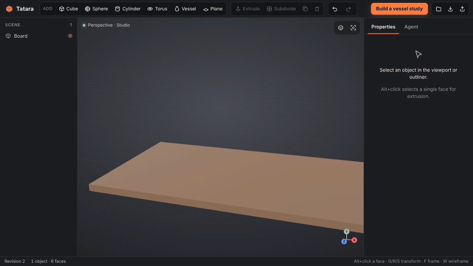
</p>

<h1 align="center">Tatara</h1>

<p align="center"><b>An AI-native 3D editor, built with Rust.</b><br>
Create in your browser. Give your agent the same tools. Keep every edit inspectable and undoable.</p>

<p align="center"><a href="https://rsasaki0109.github.io/Tatara/"><b>▶ Try it in your browser</b></a> — no install; the Rust core runs as WebAssembly.</p>

<table>
  <tr>
    <td width="50%">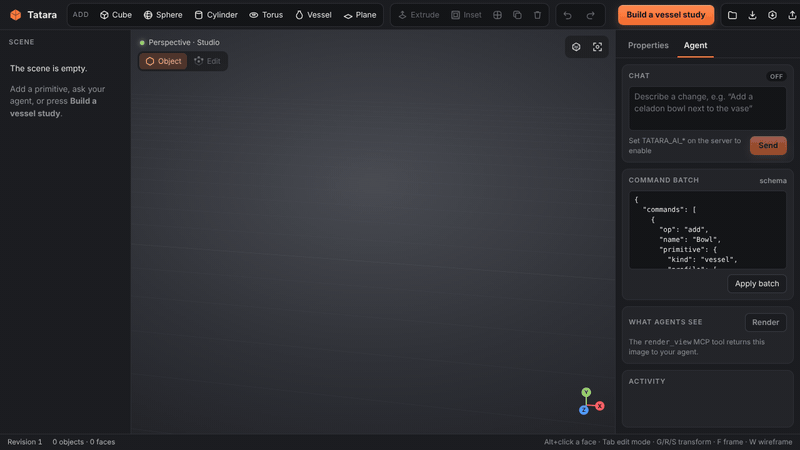</td>
    <td width="50%">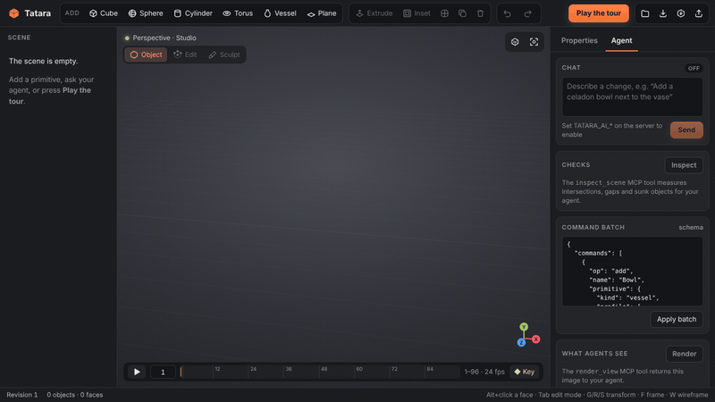</td>
  </tr>
  <tr>
    <td><b>See</b> — agents render the scene, spot their own mistakes and fix them.</td>
    <td><b>Measure</b> — <code>inspect_scene</code> finds intersections, gaps and sunk objects; <code>drop</code> settles them.</td>
  </tr>
  <tr>
    <td width="50%">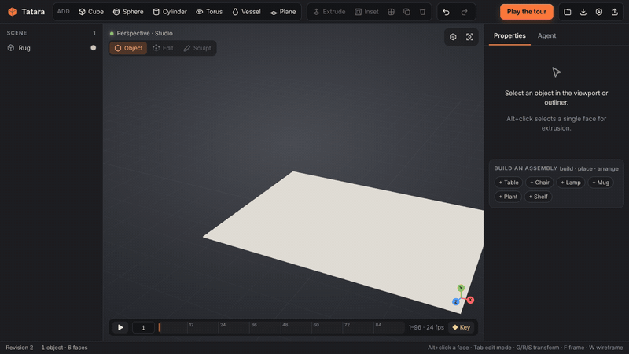</td>
    <td width="50%"></td>
  </tr>
  <tr>
    <td><b>Arrange</b> — <code>build</code> furniture, <code>place</code> it on or beside things, <code>arrange</code> in a circle: relations, not coordinates.</td>
    <td><b>Ask</b> — chat turns into an atomic, undoable command batch.</td>
  </tr>
  <tr>
    <td width="50%">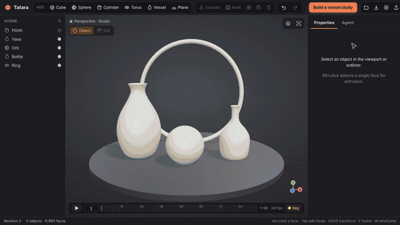</td>
    <td width="50%">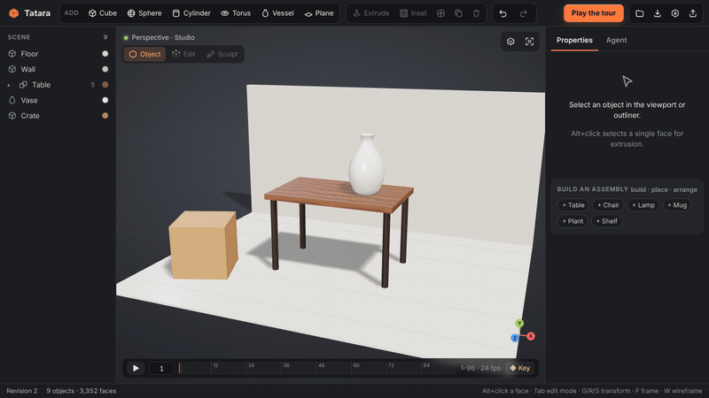</td>
  </tr>
  <tr>
    <td><b>Shade</b> — glass, metal, jade and neon presets; glowing surfaces bloom and are keyable.</td>
    <td><b>Texture</b> — wood, marble, brick and tile patterns with no UV unwrapping, baked into glTF.</td>
  </tr>
  <tr>
    <td width="50%">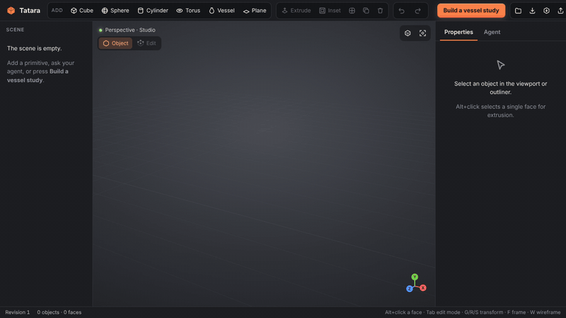</td>
    <td width="50%">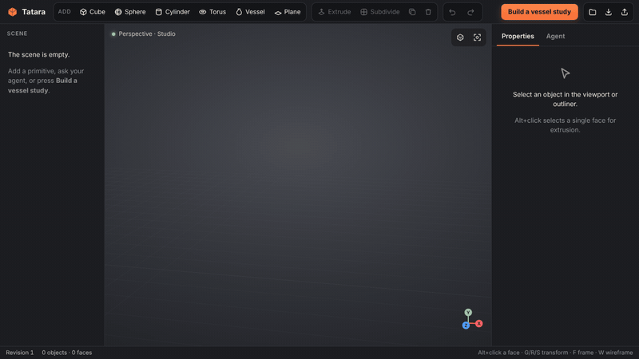</td>
  </tr>
  <tr>
    <td><b>Edit</b> — vertex, edge and face selection, loop cut, move and bevel.</td>
    <td><b>Model</b> — Alt+click a face, extrude, subdivide, glaze.</td>
  </tr>
  <tr>
    <td width="50%">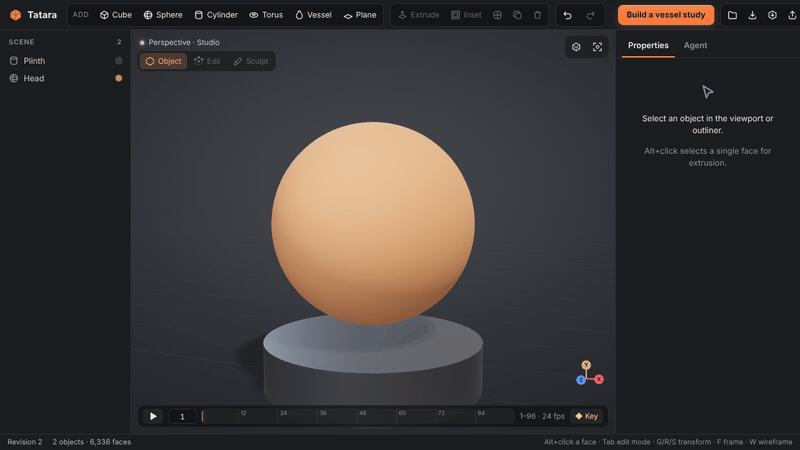</td>
    <td width="50%">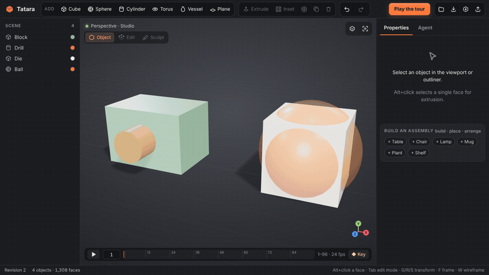</td>
  </tr>
  <tr>
    <td><b>Sculpt</b> — draw, carve, grab, inflate and smooth with mirror symmetry.</td>
    <td><b>Cut</b> — boolean difference, union and intersect, from the panel or an agent.</td>
  </tr>
  <tr>
    <td width="50%">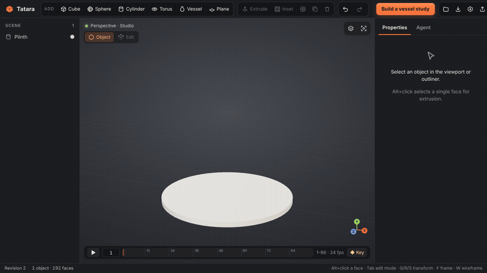</td>
    <td width="50%"></td>
  </tr>
  <tr>
    <td><b>Animate</b> — key a pose, scrub, edit (auto-key), play; exports as a glTF animation.</td>
    <td><b>Stack</b> — non-destructive modifiers; edit the base and every layer follows.</td>
  </tr>
  <tr>
    <td width="50%">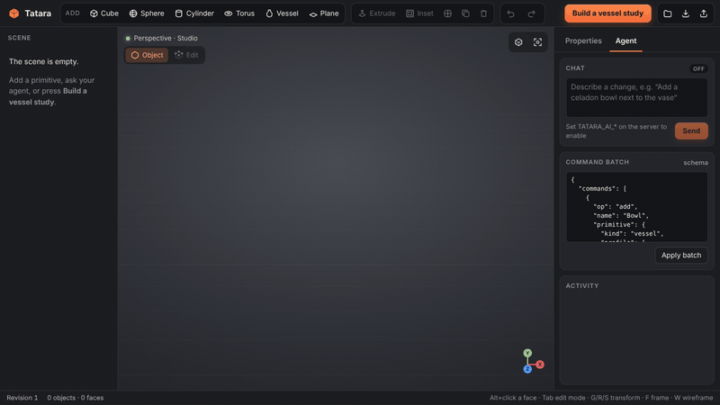</td>
    <td width="50%">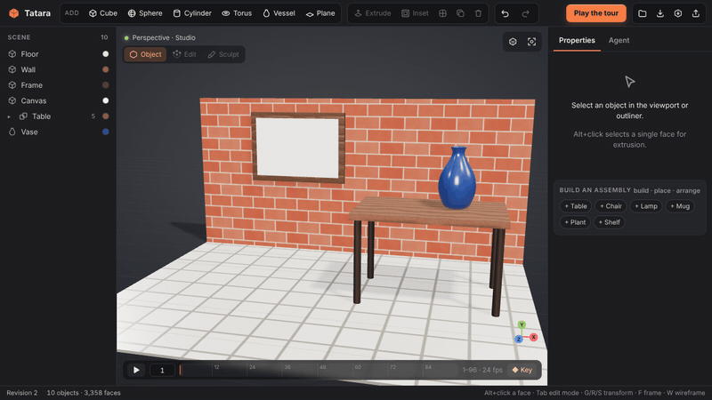</td>
  </tr>
  <tr>
    <td><b>Connect</b> — any MCP agent edits the scene you are looking at.</td>
    <td><b>Surface</b> — relief and normal maps, and pictures from any PNG or JPEG.</td>
  </tr>
  <tr>
    <td width="50%">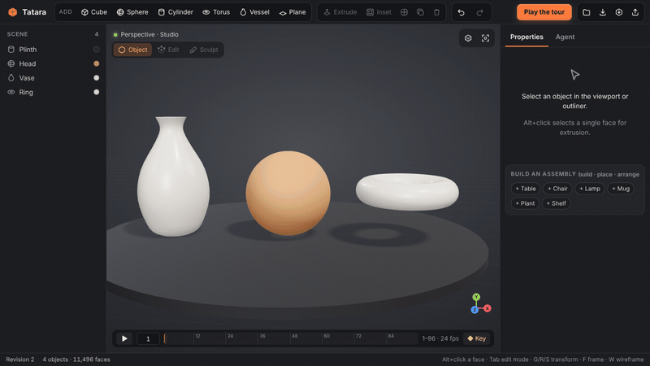</td>
    <td width="50%"></td>
  </tr>
  <tr>
    <td><b>Wrap</b> — textures blend across curved surfaces with no seams, even while you sculpt.</td>
    <td></td>
  </tr>
</table>

Every GIF above is a deterministic recording of the real editor: real toolbar clicks and face picks, real Rust mesh operations and a real `tatara --mcp` process. The chat clip replays a fixed command batch, so it needs no API key. In the *See* clip the agent's decisions are scripted, but every tool call, including the images it gets back, comes from a real `tatara --mcp` process. Regenerate them all with `node scripts/record-demo.mjs`.

## Why Tatara

Blender is the benchmark for what a 3D suite can do. Tatara starts from a different premise: **agents are first-class users**. Every action, from a toolbar click to a chat request or an MCP call, becomes the same typed command. That gives you:

- **One command API for everything.** The UI, the in-editor chat and external agents all call `POST /api/commands`, described by a generated JSON Schema at `GET /api/schema`.
- **Edits you can trust.** A batch is validated and applied atomically: if any command fails, nothing changes. Each batch is one undo step, and `expected_revision` rejects edits based on a stale scene.
- **A shared, live scene.** Agents edit the scene open in your browser, and the change appears immediately.
- **Reproducible output.** Scenes are plain JSON, geometry is generated in Rust, and demo workflows replay frame-for-frame.

It is early. Today it is a modeling prototype, and the [roadmap](#roadmap) shows the way toward a full creation suite.

## Try it

**In the browser:** open **https://rsasaki0109.github.io/Tatara/**. The Rust modeling core runs in the tab as WebAssembly, with no server and no install. Modeling, modifiers, edit mode, glTF import/export and the agent renderer all work there. The scene lives in that tab, so use **Save** to keep it. MCP and chat need the desktop server below.

**On your machine** (needed for MCP agents and chat):

Requirements: current stable Rust, Node.js 22+, and a browser with WebGL 2.

```sh
git clone https://github.com/rsasaki0109/Tatara.git
cd Tatara
npm --prefix web ci
npm --prefix web run build
cargo run --release
```

Open **http://127.0.0.1:3000** and click **Play the tour**, or add a primitive from the toolbar.

The Rust process owns the scene and keeps it in memory. Use **Save** to download a `.tatara.json` file and **Open** to restore one. **Open** also imports `.glb` / `.gltf` models into the current scene, and **GLB** / **OBJ** export the scene for other tools.

## What works today

- **Workspace:** studio lighting with shadows, orbit and zoom, outliner, properties panel, transform gizmo, polygon wireframe, axis widget and a phone layout.
- **Geometry (Rust):** cube, plane, UV sphere, quad sphere (even quads for sculpting), cylinder or cone, torus, and hollow **vessels** revolved from a smoothed cross section.
- **Modeling:** transform, glaze presets and PBR material, rename, duplicate, array, delete, per-face inset and extrusion, and Catmull-Clark subdivision.
- **Sculpt mode:** draw, inflate, smooth, flatten and grab brushes with a smooth falloff and X mirror symmetry. Ctrl carves, Shift smooths and `[` `]` resize the brush. The stroke previews live while you drag and is committed as one `sculpt` command (one undo step), so agents sculpt with exactly the same operation. **Smooth shading** blends normals across edges, in the viewport, agent renders and glTF export alike.
- **Booleans:** `boolean` cuts one object out of another (`difference`), merges them (`union`) or keeps their overlap (`intersect`), with a BSP-tree CSG in Rust. The result is welded and its T-junctions repaired, so it stays watertight and renders without cracks. The Properties panel has a Boolean card, and the cutter is consumed unless you keep it.
- **Edit mode (Tab):** vertex, edge and face selection with Shift+click and select all; move a selection with the gizmo; loop cut; bevel selected edges or every edge; extrude and inset several faces at once.
- **Materials:** PBR colour, roughness and metalness, plus emission (with a strength above 1 for glow), opacity and transmission for glass. Sixteen presets cover glass, frosted glass, chrome, steel, gold, copper, jade, ceramic, clay, plastic, rubber, neon, wood, marble, brick and tiles; any field given alongside a preset overrides it. Emissive surfaces bloom in the viewport and in agent renders, and glass shows what is behind it in both.
- **Textures:** procedural wood, marble, brick, tile, checker and stripe patterns mix the material colour with a second colour. Nothing needs UV unwrapping: textures are projected along the object's axes, and `scale` is the size of one tile in metres of the object as scaled (a long wall gets more bricks, not wider ones). Flat faces take the projection they face; curved surfaces blend the three projections by their normal (triplanar), so vases, spheres and sculpts show no seams, in the viewport's shader and in agent renders alike. Each texture is defined once in Rust (`src/texture.rs`): the viewport shows tiles baked by the core, agent renders sample the same functions, and glTF export bakes them into PNGs with `TEXCOORD_0`, so the model looks the same in any viewer. Furniture from `build` comes in wood grain.
- **Relief and images:** `relief` (0–1) turns a pattern into bumps: mortar, grout and grain sink in, through a normal map in the viewport, per-pixel normals in agent renders and a baked `normalTexture` with tangents in glTF. Any PNG or JPEG can be stored in the scene (`add_image`, or **Image…** on the Material card) and used as a texture tinted by the material colour, with `fit` to cover each side once like a label or a poster, or as a `normal_map`. Relief also works on pictures, from their brightness. Images travel inside scene files, undo steps and glTF.
- **Animation:** keyframes for location, rotation, scale, colour, roughness, metalness, emission and opacity, with ease, linear or step interpolation. The timeline plays back, scrubs and marks keys with diamonds. **K** keys every property, and editing a value that already has keys adds a key at the current frame (auto-key). Transform tracks export as glTF animation channels, which pass the Khronos validator. Agents can read a pose (`get_scene` with `frame`) and render any frame (`render_view` with `frame`).
- **Modifier stack:** non-destructive Mirror, Subdivision, Array, Twist and Taper, evaluated in Rust in order. The base mesh stays editable and is drawn as an orange cage. **Apply** bakes the stack into the base mesh.
- **History:** each batch is one undo step, and an invalid batch changes nothing.
- **Files:** validated JSON scene save/open, and OBJ export with transforms applied.
- **glTF 2.0:** export a binary `.glb` with one node, mesh and PBR material per object (emission, `KHR_materials_emissive_strength`, `KHR_materials_transmission`, alpha blending texture images, normal maps, UVs and tangents included), modifiers applied and normals split at creases; it passes the Khronos glTF Validator with no errors or warnings. Import `.glb` or `.gltf` with embedded buffers through the node hierarchy. Base colour and normal textures come in as scene images, and textured meshes keep their UVs per face corner. Split vertices are welded and coplanar triangle pairs become quads again (never across a UV seam), so imported models stay editable. The whole import is one undo step.
- **Agents:** a stdio MCP bridge, generated command schemas, scene bounds, optional full mesh reads and `render_view`. That tool gives agents eyes: a headless Rust renderer returns labelled multi-view PNGs, and the Agent panel shows the same image to you. `inspect_scene` gives them a ruler: it measures intersections (with depth), objects floating above their support (with the gap) and anything sunk below the floor, and the **Checks** card shows the same report with the culprits outlined in red. The `drop` command settles an object on whatever is beneath it.
- **Layout by relation:** `build` makes furniture from primitives at real-world size (table, chair, lamp, mug, plant, shelf), each piece one **group** that `move`, `drop`, `delete`, `place` and `arrange` treat as a unit. `place` puts something on another object (`at` a spot of its top) or beside it; `arrange` lays items out in a row, a grid or a circle around something, turned to face it. Everything settles onto what is below it, so agents never compute coordinates. The outliner folds each group into one row, and the empty Properties panel builds the same pieces with one click.
- **Chat (optional):** an OpenAI-compatible Chat Completions endpoint translates requests into validated commands.

| Key | Action | Key | Action |
| --- | --- | --- | --- |
| Alt + click | Select a face (on the base cage) | E / I | Extrude / inset selected face |
| G / R / S | Move / rotate / scale gizmo | Shift + D | Duplicate |
| F | Frame scene | X / Delete | Delete |
| W | Wireframe | Ctrl/Cmd + Z | Undo (add Shift to redo) |
| Tab | Edit mode | 1 / 2 / 3 | Vertex / edge / face select (edit mode) |
| Space | Play / pause | K | Key the selection at this frame |
| ← / → | Previous / next frame | | |
| A | Select all (edit mode) | Ctrl + B / Ctrl + R | Bevel / loop cut |
| Esc | Leave edit mode or deselect | Ctrl/Cmd + S | Save |

Units are meters and Y is up. The inspector shows rotations in degrees; the command API takes radians.

## Connect your agent

Start the editor first, then add Tatara to your MCP client's configuration:

```json
{
  "mcpServers": {
    "tatara": {
      "command": "cargo",
      "args": ["run", "--release", "--manifest-path", "/absolute/path/to/Tatara/Cargo.toml", "--", "--mcp"]
    }
  }
}
```

You can also build once and point the client at `target/release/tatara` with `args: ["--mcp"]`.

| Tool | Purpose |
| --- | --- |
| `get_scene` | IDs, names, transforms, materials, world bounds, counts and revision. Pass `include_mesh: true` for vertices and polygons. |
| `apply_commands` | Apply a validated, atomic batch. Pass `expected_revision` to reject stale edits. |
| `undo` / `redo` | Step the shared history. |
| `import_gltf` / `export_gltf` | Read a local `.glb`/`.gltf` into the scene, or write the scene to a `.glb`. |
| `inspect_scene` | **Measure the scene.** Lists intersections with their depth, floating objects with their gap and objects below the floor, plus each object's world bounds, size and what it rests on. |
| `render_view` | **Look at the scene.** Returns a PNG of up to six labelled views (`front`, `back`, `left`, `right`, `top`, `bottom`, `iso` or `azimuth:elevation`). It has shadows, outlines, see-through glass, glowing emission and a 1 m ground grid. Pass `object` to frame one object, and `frame` to pose animation at that frame. |

Example request for your agent:

> Make a hollow celadon vase with a wide belly and a narrow neck, and a smaller terracotta one beside it.

The bridge connects to `http://127.0.0.1:3000`. Set `TATARA_URL` if the editor runs elsewhere.

## Command API

```sh
curl http://127.0.0.1:3000/api/commands \
  -H 'Content-Type: application/json' \
  -d '{"commands":[
        {"op":"add","name":"Vase","primitive":{"kind":"vessel","profile":[[0.12,0],[0.27,0.28],[0.12,0.72],[0.11,0.9]]},"color":"#8fb9a0","roughness":0.22},
        {"op":"duplicate","id":"Vase","offset":[0.8,0,0]}
      ]}'
```

| Op | Fields |
| --- | --- |
| `add` | `primitive` (`cube`, `plane`, `sphere`, `quadsphere`, `cylinder`, `torus`, `vessel`), optional `name`, `translation`, `rotation`, `scale` and material fields |
| `transform` / `material` / `rename` | `id`, plus the fields to change |
| `sculpt` | `id`, `brush` (`draw`, `inflate`, `smooth`, `flatten`, `grab`), `points` (stroke path in object space), `radius`, optional `strength` (0–1), `invert`, `symmetry` (`x`, `y`, `z`) and, for `grab`, `offset` |
| `shade` | `id`, `smooth` (`true` for smooth shading) |
| `drop` | `id`: move it straight down onto the floor or the object below it (or up, out of whatever it sank into) |
| `build` | `template` (`table`, `chair`, `lamp`, `mug`, `plant`, `shelf`), optional `name` (the group), `translation`, `rotation_y`, `scale`, `color` |
| `place` | `id`, then `on` (+ optional `at` [u, v]) or `beside` (+ `side`: `left`, `right`, `front`, `back`, and `gap`) |
| `arrange` | `ids`, `layout` (`row`, `grid`, `circle`), optional `around`, `center` [x, z], `spacing`, `radius` |
| `move` | `id`, optional `offset` and `rotate_y` (radians, about its centre) |
| `boolean` | `id`, `with`, `operation` (`difference`, `union`, `intersect`), optional `keep` (keep the other object) |
| groups | every command that takes an `id` (`move`, `place`, `arrange`, `drop`, `delete`) also accepts a group name |
| material fields | `preset` (`glass`, `frosted`, `chrome`, `steel`, `gold`, `copper`, `jade`, `ceramic`, `clay`, `plastic`, `rubber`, `neon`, `wood`, `marble`, `brick`, `tiles`), `color`, `roughness`, `metalness`, `emissive` (`#rrggbb`), `emissive_strength` (0–20), `opacity`, `transmission`, `texture` (`{"pattern": "wood" \| "marble" \| "brick" \| "tiles" \| "checker" \| "stripes" \| "image" \| "none", "color2": "#rrggbb", "scale": metres per tile, "image": name, "fit": bool, "relief": 0–1, "normal_map": name}`) |
| `add_image` / `delete_image` | `name`, and `data` (a PNG or JPEG as base64 or a `data:` URL; up to 8 MB and 4096 px) / `name` (only when no material uses it) |
| `duplicate` / `array` | `id`, `offset` (and `count` for `array`) |
| `extrude` / `inset` | `id`, `face`, and `distance` or `fraction` (0–1) |
| `move_vertices` | `id`, `vertices` (indices), `offset` |
| `bevel` | `id`, `width`, optional `edges` as `[[a, b], …]` (all edges when omitted) |
| `loop_cut` | `id`, `edge` `[a, b]`, optional `fraction` |
| `set_keyframe` | `id`, `property` (`translation`, `rotation`, `scale`, `color`, `roughness`, `metalness`, `emissive`, `emissive_strength`, `opacity`), `frame`, optional `value` (current value if omitted; colours as `#rrggbb`) and `interpolation` (`ease`, `linear`, `step`) |
| `delete_keyframe` / `clear_animation` | `id`, `frame` / optional `property` |
| `set_animation` | `fps`, `start`, `end` |
| `add_modifier` / `set_modifier` / `remove_modifier` | `id`, `modifier` (`mirror`, `subdivision`, `array`, `twist`, `taper`), `index` |
| `apply_modifiers` | `id`: bake the stack into the base mesh |
| `add_mesh` | explicit `vertices` and `faces` (CCW loops), plus the optional fields of `add` |
| `subdivide` | `id`, `levels` (1–4) |
| `delete` / `clear` | `id` / nothing |

`id` accepts a numeric ID or an exact object name. New objects take IDs from the scene's `next_id`, in order. Face indices refer to the base mesh. An extruded or inset face keeps its index, and its four new side faces are appended in edge order, so an agent can chain edits without re-reading the mesh. `get_scene` reports both the base and evaluated face counts, and bounds come from the evaluated mesh.

```json
{"commands": [
  {"op": "add", "name": "Tower", "primitive": {"kind": "cube"}, "scale": [1, 0.3, 1]},
  {"op": "add_modifier", "id": "Tower", "modifier": {"type": "array", "count": 9, "offset": [0, 1.2, 0]}},
  {"op": "add_modifier", "id": "Tower", "modifier": {"type": "twist", "angle": 4.7}},
  {"op": "add_modifier", "id": "Tower", "modifier": {"type": "taper", "factor": 0.35}},
  {"op": "add_modifier", "id": "Tower", "modifier": {"type": "subdivision", "levels": 1}}
]}
```

Other routes are `GET /api/scene`, `GET /api/context`, `GET /api/state`, `PUT /api/scene`, `POST /api/undo`, `POST /api/redo`, `GET /api/export/obj`, `GET /api/export/glb`, `POST /api/import` (raw `.glb`/`.gltf` body), `GET /api/render?views=front,top&size=512&object=Vase&frame=24` (PNG), `GET /api/context?frame=24` (poses at a frame), `GET /api/inspect` (the `inspect_scene` report) and `GET /api/events`. The last is a server-sent event stream of revisions.

## Optional in-editor chat

Configure an OpenAI-compatible provider on the **server**. The key never reaches the browser.

```sh
export TATARA_AI_BASE_URL="http://127.0.0.1:11434/v1"
export TATARA_AI_MODEL="your-model-name"
# export TATARA_AI_API_KEY="..."   # if the provider needs one
cargo run --release
```

Chat sends your prompt, a scene summary and the command schema to `/chat/completions`. It applies the returned JSON batch at the revision the prompt saw. Invalid or stale replies are rejected, and successful ones are undoable. Integration tests cover this path with a mock provider; it has not been tested against live hosted models.

## README GIFs

The GIFs come from scripted workflows in [`web/src/scenarios.js`](web/src/scenarios.js). They are rendered with the following pipeline:

1. `scripts/record-demo.mjs` starts a fresh `tatara` server for each scenario and opens the editor in headless Chromium with `?capture=1`.
2. In capture mode the editor runs on a **virtual clock**. The recorder advances it one frame at a time and waits for every API call, then takes a screenshot. Slow software rendering therefore never drops a frame, and every run produces the same GIF.
3. A scenario drives the editor through the real UI: a cursor clicks toolbar buttons and glaze chips, picks faces in the viewport and types into fields. Captions explain each step, and MCP scenarios talk to a real `tatara --mcp` child process.
4. ffmpeg encodes the frames with a two-pass palette into `docs/media/<scenario>.gif`.

```sh
node scripts/record-demo.mjs                # every scenario
node scripts/record-demo.mjs hero modeling  # selected ones
node scripts/record-demo.mjs --fps 12 --mp4 # lower frame rate, also write MP4
```

This needs ffmpeg and a Chromium build. Set `TATARA_BROWSER_PATH` if Playwright's own browser is not installed. To add a GIF, add a scenario to `SCENARIOS`; the recorder picks it up automatically. The **Play the tour** button plays the `hero` scenario live.

## Architecture

| Part | Implementation |
| --- | --- |
| Geometry, commands, validation, history, OBJ | Rust: `src/engine.rs` |
| glTF export and import | Rust: `src/gltf.rs` |
| Headless renderer for agent vision | Rust: `src/render.rs` (CPU rasterizer, shadow map, no GPU needed) |
| Scene inspection and `drop` | Rust: `src/inspect.rs` (point-in-mesh, penetration depth, support search) |
| Assemblies and relational layout | Rust: `src/assembly.rs` (templates, `place`, `arrange`, group moves) |
| Boolean operations | Rust: `src/csg.rs` (arena BSP trees after csg.js, T-junction repair) |
| Textures, relief, box and triplanar projection | Rust: `src/texture.rs` (served as PNG tiles by `/api/texture`; the viewport's shader mirrors the blend) |
| Scene images (PNG, JPEG) | Rust: `src/image.rs` (served by `/api/image`) |
| Shared API router (server and browser) | Rust: `src/api.rs` |
| Browser-only build | Rust → WebAssembly: `wasm/` (plain C ABI, no bindgen) + `web/src/backend.js` |
| Modifier stack evaluation | Rust: `src/modifiers.rs` |
| Bevel, loop cut, vertex moves | Rust: `src/edit.rs` |
| Keyframes and sampling | Rust: `src/anim.rs` (mirrored for playback in `web/src/anim.js`) |
| Sculpt brushes | Rust: `src/sculpt.rs` (mirrored for the live stroke preview in `web/src/sculpt.js`) |
| HTTP API, live events, chat provider | Rust: `src/server.rs` (axum) |
| Stdio MCP bridge | Rust: `src/mcp.rs` |
| Editor UI and WebGL presentation | JavaScript + Three.js: `web/src` |
| Scripted workflows, recorder, smoke test | `web/src/scenarios.js`, `scripts/` |

The native server and the WebAssembly build answer `/api` through the same `api::handle` router. In the browser build, `backend.js` sends the editor's `/api` requests into the module, so the UI is identical in both. Build the static site with `node scripts/build-static.mjs` (output in `web/dist-static/`), and check it with `node scripts/static-check.mjs`. The `Pages` workflow publishes it on every push to `main`.

The browser is a presentation layer; geometry and authoritative edits run in Rust. The server binds to loopback and is single-user.

## Development

```sh
cargo fmt --check
cargo clippy --all-targets -- -D warnings
cargo test --workspace           # engine, API router, HTTP, MCP bridge, mock chat, wasm ABI
npm --prefix web ci && npm --prefix web run build
cargo build --release
node scripts/browser-check.mjs   # real-browser editing, history, files, layout and all scenarios
rustup target add wasm32-unknown-unknown
node scripts/build-static.mjs    # browser-only build in web/dist-static
node scripts/static-check.mjs    # drives it under a /Tatara/ sub-path with no server
```

`TATARA_PORT` changes the port, and `TATARA_WEB_DIR` points at the built assets when you move the binary. The browser check starts its own isolated server.

## Roadmap

The aim is a creation suite that surpasses Blender for human and agent collaboration, taken one verifiable step at a time:

1. **Modeling depth:** ~~modifier stack~~ ✓, ~~inset~~ ✓, ~~edit mode, bevel, loop cut~~ ✓, ~~sculpting~~ ✓; ~~booleans~~ ✓; next: dynamic topology and multires sculpting, multi-segment bevel, knife, merge and dissolve, and solidify/bevel/boolean modifiers.
2. **Interchange:** ~~glTF import and export~~ ✓, ~~browser-only Rust/WASM build~~ ✓, ~~textures and UVs in glTF~~ ✓, ~~image and normal textures both ways~~ ✓; next: metallic-roughness, occlusion and emissive maps, and opening `.tatara.json` links directly in the web build.
3. **Look development:** ~~emission, glass, opacity and material presets~~ ✓, ~~procedural textures~~ ✓, ~~relief, image textures and normal maps~~ ✓, ~~seamless triplanar blending~~ ✓; next: a node-based material system, UV editing and a path-traced preview.
4. **Motion:** ~~keyframes and timeline~~ ✓; next: a graph editor for curves, animating modifier parameters, constraints, then rigging.
5. **Agents:** ~~visual feedback (`render_view`)~~ ✓, ~~measurements and collision reports (`inspect_scene`)~~ ✓; ~~layout by relation (`build`, `place`, `arrange`)~~ ✓; next: reviewable change proposals, constraints such as "keep on the table", more templates and multi-user sessions.

Not yet available: `.blend` compatibility, UV editing, rigging and a production renderer. Extrusion moves a face along its normal and does not repair self-intersections. OBJ carries geometry only. glTF carries geometry, transforms, PBR factors with emission, transmission and alpha, and transform animation, and textures with UVs and normal maps, but no material animation yet. Imports read base colour and normal textures on the first UV set; other maps and `KHR_texture_transform` are ignored, and images in external files are skipped. Edits that change a mesh's topology (extrude, subdivide, booleans, mirror) drop its own UVs and fall back to projection. glTF has no triplanar blending, so exported projected textures use the side each face is turned to, which shows seams on curved surfaces in other viewers. Importing a sheared node hierarchy bakes the transform into the vertices. Save the native scene to keep modifiers and edit history.

## License

Dual-licensed under **MIT OR Apache-2.0**. Tatara is an independent implementation and contains no Blender code.
