<p align="center">
  
</p>

<h1 align="center">Tatara</h1>

<p align="center"><b>An AI-native 3D editor, built with Rust.</b><br>
Create in your browser. Give your agent the same tools. Keep every edit inspectable and undoable.</p>

<p align="center"><a href="https://rsasaki0109.github.io/Tatara/"><b>▶ Try it in your browser</b></a> — no install; the Rust core runs as WebAssembly.</p>

<table>
  <tr>
    <td width="50%"></td>
    <td width="50%"></td>
  </tr>
  <tr>
    <td><b>See</b> — agents render the scene, spot their own mistakes and fix them.</td>
    <td><b>Measure</b> — <code>inspect_scene</code> finds intersections, gaps and sunk objects; <code>drop</code> settles them.</td>
  </tr>
  <tr>
    <td width="50%"></td>
    <td width="50%"></td>
  </tr>
  <tr>
    <td><b>Arrange</b> — <code>build</code> furniture, <code>place</code> it on or beside things, <code>arrange</code> in a circle: relations, not coordinates.</td>
    <td><b>Ask</b> — chat turns into an atomic, undoable command batch.</td>
  </tr>
  <tr>
    <td width="50%"></td>
    <td width="50%"></td>
  </tr>
  <tr>
    <td><b>Shade</b> — glass, metal, jade and neon presets; glowing surfaces bloom and are keyable.</td>
    <td><b>Texture</b> — wood, marble, brick and tile patterns with no UV unwrapping, baked into glTF.</td>
  </tr>
  <tr>
    <td width="50%"></td>
    <td width="50%"></td>
  </tr>
  <tr>
    <td><b>Edit</b> — vertex, edge and face selection, loop cut, move and bevel.</td>
    <td><b>Model</b> — Alt+click a face, extrude, subdivide, glaze.</td>
  </tr>
  <tr>
    <td width="50%"></td>
    <td width="50%"></td>
  </tr>
  <tr>
    <td><b>Sculpt</b> — draw, carve, grab, inflate and smooth with mirror symmetry.</td>
    <td><b>Cut</b> — boolean difference, union and intersect, from the panel or an agent.</td>
  </tr>
  <tr>
    <td width="50%"></td>
    <td width="50%"></td>
  </tr>
  <tr>
    <td><b>Animate</b> — key a pose, scrub, edit (auto-key), play; exports as a glTF animation.</td>
    <td><b>Stack</b> — non-destructive modifiers; edit the base and every layer follows.</td>
  </tr>
  <tr>
    <td width="50%"></td>
    <td width="50%"></td>
  </tr>
  <tr>
    <td><b>Connect</b> — any MCP agent edits the scene you are looking at.</td>
    <td><b>Surface</b> — relief and normal maps, and pictures from any PNG or JPEG.</td>
  </tr>
  <tr>
    <td width="50%"></td>
    <td width="50%">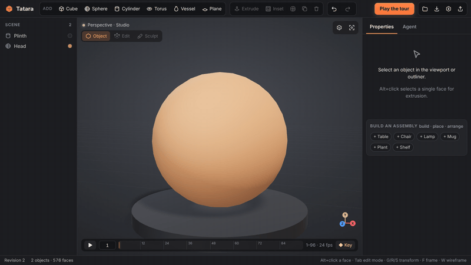</td>
  </tr>
  <tr>
    <td><b>Wrap</b> — textures blend across curved surfaces with no seams, even while you sculpt.</td>
    <td><b>Refine</b> — dynamic detail adds faces only where the brush goes.</td>
  </tr>
  <tr>
    <td width="50%">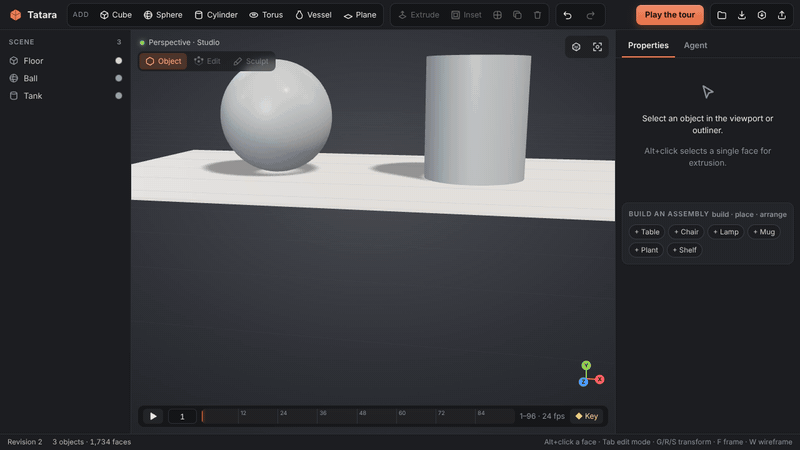</td>
    <td width="50%">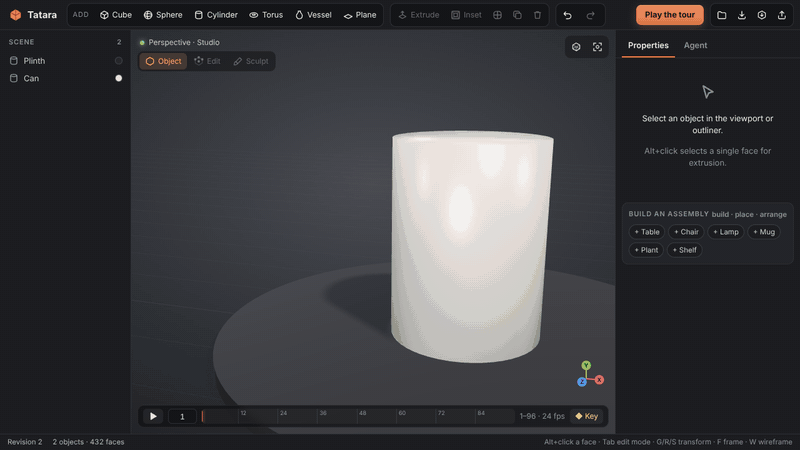</td>
  </tr>
  <tr>
    <td><b>Nodes</b> — wire noise, Voronoi, ramps and maths into materials; agents write the same graph.</td>
    <td><b>Unwrap</b> — cut seams, unwrap to UV islands and lay them out over a UV grid.</td>
  </tr>
  <tr>
    <td width="50%">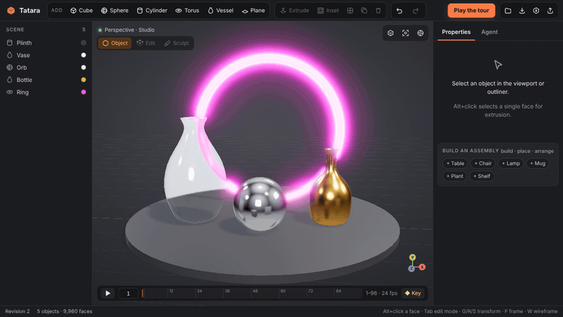</td>
    <td width="50%">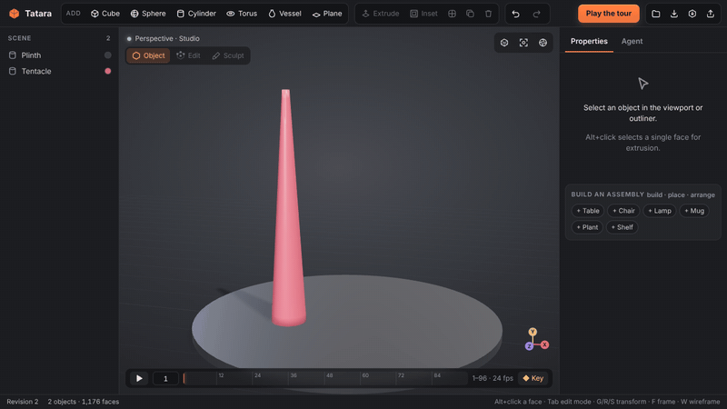</td>
  </tr>
  <tr>
    <td><b>Render</b> — path trace the view: glass, mirrors, soft shadows and glow, refined live.</td>
    <td><b>Rig</b> — bones bend meshes with automatic weights; key poses and export glTF skins.</td>
  </tr>
  <tr>
    <td width="50%">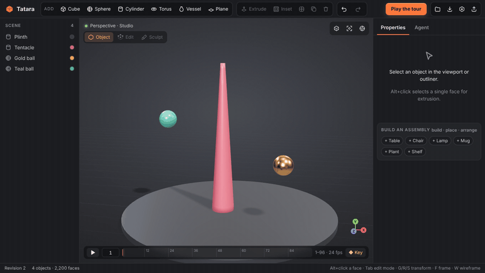</td>
    <td width="50%">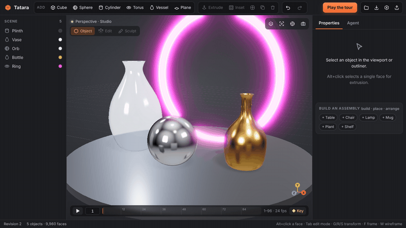</td>
  </tr>
  <tr>
    <td><b>Reach</b> — drag a bone's tip and the chain bends to follow (inverse kinematics).</td>
    <td><b>Final render</b> — full-size path-traced stills and animated PNGs, with depth of field.</td>
  </tr>
  <tr>
    <td width="50%">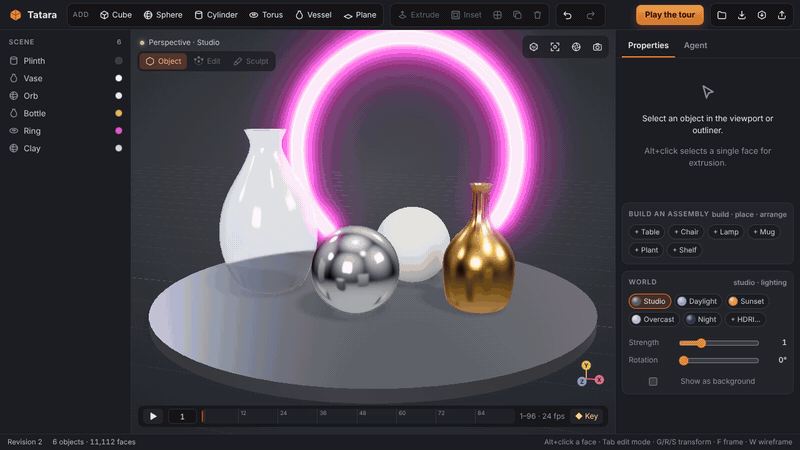</td>
    <td width="50%">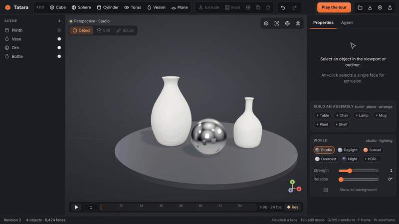</td>
  </tr>
  <tr>
    <td><b>World</b> — light with daylight, sunset, overcast or night skies, or your own HDRI.</td>
    <td><b>Proposals</b> — agents offer changes and options; preview each in place, accept one.</td>
  </tr>
  <tr>
    <td width="50%">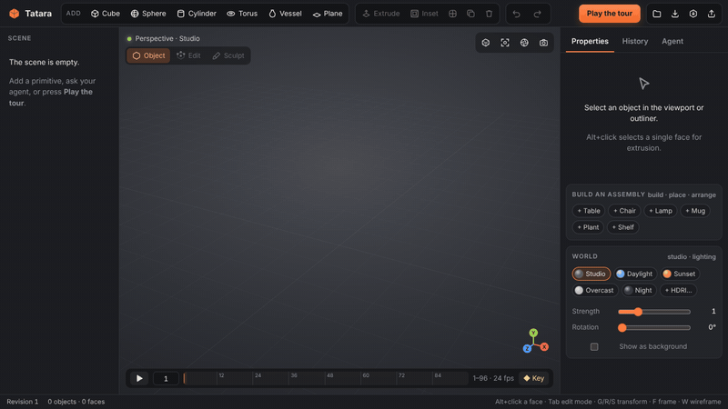</td>
    <td width="50%">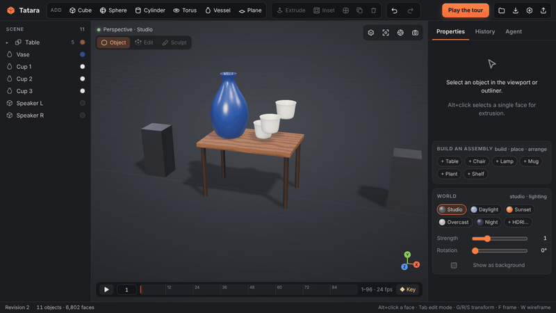</td>
  </tr>
  <tr>
    <td><b>History</b> — change any earlier step; everything after it replays.</td>
    <td><b>Constraints</b> — keep on, mirror and match: say it once, it holds through every edit.</td>
  </tr>
  <tr>
    <td width="50%">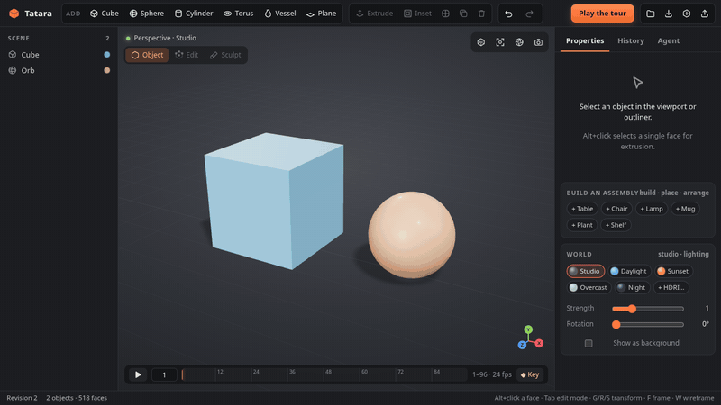</td>
    <td><b>Shared session</b> — see another person or agent’s cursor, selection and camera, review who changed what, and refuse stale edits safely.</td>
  </tr>
  <tr>
    <td width="50%">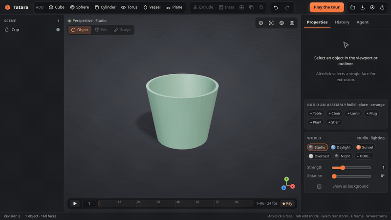</td>
    <td><b>Chat, then review</b> — keep the original while AI suggests a change, preview it, and accept it as one undo step.</td>
  </tr>
  <tr>
    <td width="50%">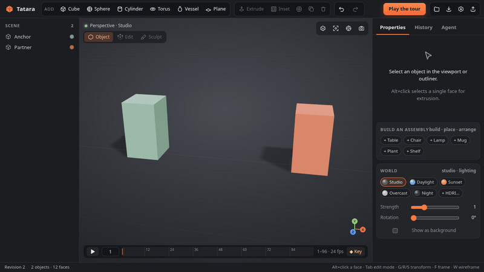</td>
    <td><b>Keep the distance</b> — either object can lead while their centre distance stays fixed, with the same result in proposals and history.</td>
  </tr>
  <tr>
    <td width="50%">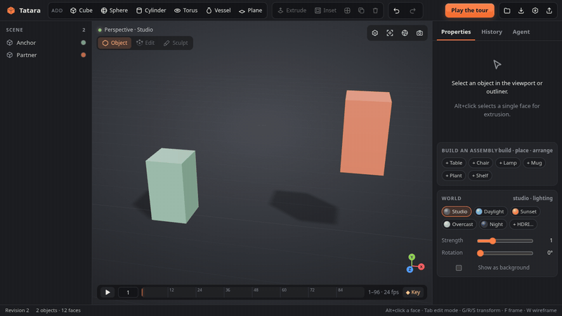</td>
    <td><b>Keep them aligned</b> — select world axes and keep centres in line through later edits, with either endpoint leading.</td>
  </tr>
  <tr>
    <td width="50%">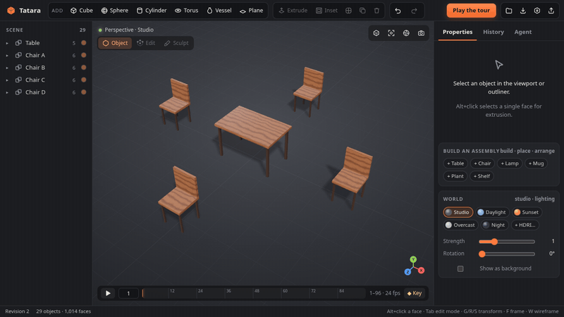</td>
    <td><b>Keep the whole layout</b> — maintained rows, grids and circles follow a reference through later edits, proposals and history.</td>
  </tr>
  <tr>
    <td width="50%">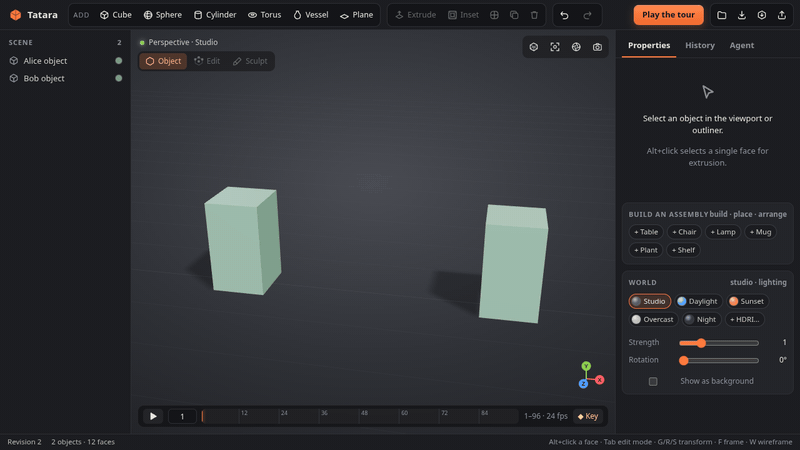</td>
    <td><b>Combine independent edits</b> — preserve both people's work when their object dependencies are unchanged; conflicting edits still need review.</td>
  </tr>
  <tr>
    <td width="50%">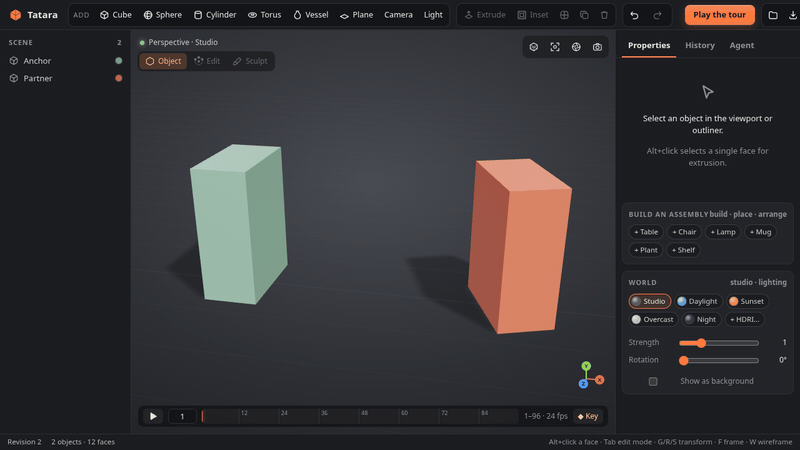</td>
    <td><b>Keep the relative orientation</b> — preserve the angle between individual objects, cameras and lights through editing, proposals and history.</td>
  </tr>
  <tr>
    <td width="50%">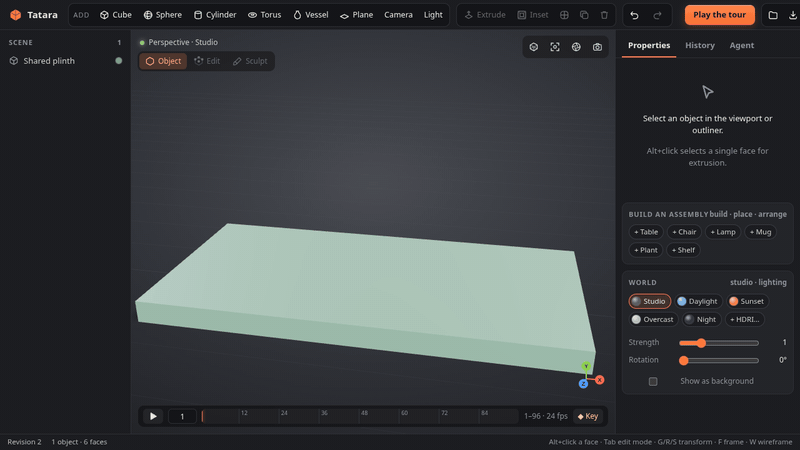</td>
    <td><b>Build together</b> — independent primitive, camera and light additions combine safely; conflicting names and mixed stale batches are refused.</td>
  </tr>
  <tr>
    <td width="50%">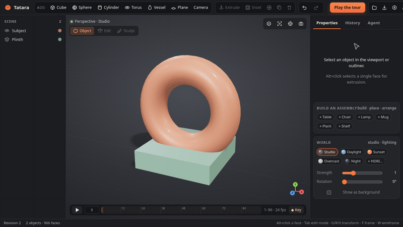</td>
    <td><b>Keep the shot</b> — camera objects store the view and lens alongside the scene, editable through commands, proposals and history.</td>
  </tr>
  <tr>
    <td width="50%">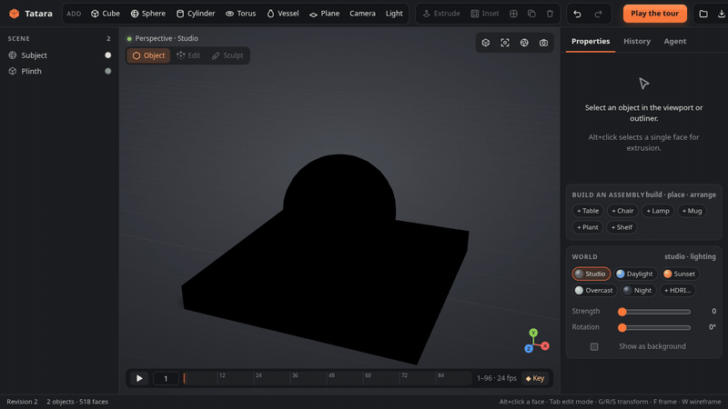</td>
    <td><b>Edit the lighting</b> — point and sun lights belong to the scene, with shared command edits, shadow rays and glTF punctual-light interchange.</td>
  </tr>
</table>

Every GIF above is a deterministic recording of the real editor: real toolbar clicks and face picks, real Rust mesh operations and a real `tatara --mcp` process. Both chat clips replay fixed command batches, so they need no API key; the review clip uses the real Rust proposal and approval path. In the *See* clip the agent's decisions are scripted, but every tool call, including the images it gets back, comes from a real `tatara --mcp` process. Regenerate them all with `node scripts/record-demo.mjs`.

## Why Tatara

Blender is the benchmark for what a 3D suite can do. Tatara starts from a different premise: **agents are first-class users**. Every action, from a toolbar click to a chat request or an MCP call, becomes the same typed command. That gives you:

- **One command API for everything.** The UI, the in-editor chat and external agents share the same typed command validation and atomic application path, described by a generated JSON Schema at `GET /api/schema`.
- **Edits you can trust.** A batch is validated and applied atomically: if any command fails, nothing changes. Each batch is one undo step. `expected_revision` rejects edits based on a stale scene by default; `rebase: true` can safely reapply supported existing-object edits whose dependencies remain unchanged, or independent creation-only batches.
- **A shared, live scene.** Multiple tabs and MCP agents edit the same local session. See each participant’s cursor, selection, camera and advisory editing locks, with command authors in the history. The UI requests safe rebase for independent existing-object edits and creation-only batches, and history marks combined edits. Conflicting or unsupported stale edits are refused with a recovery reason.
- **A history you can change.** Because every edit is a command, the scene is a recipe. Open any earlier step, change a value, and every step after it replays: rebuild the table bigger and the chairs circle it again, and the lamp placed on it stays on top.
- **Intent that holds.** Say what must stay true, such as this vase stays on the table, these speakers mirror each other, these cups share a glaze, or two objects stay two metres apart, and it holds through every later edit, by you, an agent or a replayed history.
- **Review before it lands.** The in-editor chat proposes changes for review by default. Agents can also propose a change, or several alternatives, instead of applying it. You preview each one in place, see exactly what it adds, changes and removes, and accept the one you want. Nothing changes until you do.
- **Shots belong to the scene.** Add a camera from the current view, look through it, and edit its vertical FOV, lens radius and focus distance. Camera transforms use the same animation tracks as other objects; rendered previews and final stills/animations sample the stored camera.
- **Reproducible output.** Scenes are plain JSON, geometry is generated in Rust, and demo workflows replay frame-for-frame.

It is early. Today it is a modeling prototype, and the [roadmap](#roadmap) shows the way toward a full creation suite.

## Try it

**In the browser:** open **https://rsasaki0109.github.io/Tatara/**. The Rust modeling core runs in the tab as WebAssembly, with no server and no install. Modeling, modifiers, edit mode, glTF import/export and the agent renderer all work there. The scene lives in that tab, so use **Save** to keep it. MCP and chat need the desktop server below.

**On your machine** (needed for MCP agents and chat):

Requirements: current stable Rust, Node.js 22+, and a browser with WebGL 2.

```sh
git clone https://github.com/rsasaki0109/Tatara.git
cd Tatara
npm --prefix web ci
npm --prefix web run build
cargo run --release
```

Open **http://127.0.0.1:3000** and click **Play the tour**, or add a primitive from the toolbar.

The Rust process owns the scene and keeps it in memory. Use **Save** to download a `.tatara.json` file and **Open** to restore one. **Open** also imports `.glb` / `.gltf` models into the current scene, and **GLB** / **OBJ** export the scene for other tools.

## What works today

- **Workspace:** studio lighting with shadows, orbit and zoom, outliner, properties panel, transform gizmo, polygon wireframe, axis widget and a phone layout.
- **Geometry (Rust):** cube, plane, UV sphere, quad sphere (even quads for sculpting), cylinder or cone, torus, and hollow **vessels** revolved from a smoothed cross section.
- **Modeling:** transform, glaze presets and PBR material, rename, duplicate, array, delete, per-face inset and extrusion, and Catmull-Clark subdivision.
- **Sculpt mode:** draw, inflate, smooth, flatten and grab brushes with a smooth falloff and X mirror symmetry. Ctrl carves, Shift smooths and `[` `]` resize the brush. The stroke previews live while you drag and is committed as one `sculpt` command (one undo step), so agents sculpt with exactly the same operation. **Dynamic detail** (dynamic topology) splits the edges under the brush that are longer than the detail size, so a coarse ball grows fine faces exactly where you sculpt and stays light everywhere else. **Smooth shading** blends normals across edges, in the viewport, agent renders and glTF export alike.
- **Booleans:** `boolean` cuts one object out of another (`difference`), merges them (`union`) or keeps their overlap (`intersect`), with a BSP-tree CSG in Rust. The result is welded and its T-junctions repaired, so it stays watertight and renders without cracks. The Properties panel has a Boolean card, and the cutter is consumed unless you keep it.
- **Edit mode (Tab):** vertex, edge and face selection with Shift+click and select all; move a selection with the gizmo; loop cut; bevel selected edges or every edge; extrude and inset several faces at once.
- **Materials:** PBR colour, roughness and metalness, plus emission (with a strength above 1 for glow), opacity and transmission for glass. Sixteen presets cover glass, frosted glass, chrome, steel, gold, copper, jade, ceramic, clay, plastic, rubber, neon, wood, marble, brick and tiles; any field given alongside a preset overrides it. Emissive surfaces bloom in the viewport and in agent renders, and glass shows what is behind it in both.
- **Textures:** procedural wood, marble, brick, tile, checker and stripe patterns mix the material colour with a second colour. Nothing needs UV unwrapping: unless a mesh has its own UVs, textures are projected along the object's axes, and `scale` is the size of one tile in metres of the object as scaled (a long wall gets more bricks, not wider ones). Flat faces take the projection they face; curved surfaces blend the three projections by their normal (triplanar), so vases, spheres and sculpts show no seams, in the viewport's shader and in agent renders alike. Each texture is defined once in Rust (`src/texture.rs`): the viewport shows tiles baked by the core, agent renders sample the same functions, and glTF export bakes them into PNGs with `TEXCOORD_0`, so the model looks the same in any viewer. Furniture from `build` comes in wood grain.
- **Relief and images:** `relief` (0–1) turns a pattern into bumps: mortar, grout and grain sink in, through a normal map in the viewport, per-pixel normals in agent renders and a baked `normalTexture` with tangents in glTF. Any PNG or JPEG can be stored in the scene (`add_image`, or **Image…** on the Material card) and used as a texture tinted by the material colour, with `fit` to cover each side once like a label or a poster, or as a `normal_map`. Relief also works on pictures, from their brightness. Images travel inside scene files, undo steps and glTF.
- **UV editor:** `unwrap` lays a mesh out flat in UV islands: `smart` splits it where faces turn more than 66°, `cube` and `cylinder` project like the shapes, and `seams` unrolls each piece cut by seams with least-squares conformal mapping (LSCM), so curved patches flatten without flips. Islands are scaled to their true area, turned to pack tightly and shelf-packed into the unit square. In the editor (**UV editor** on the UV card) click an island to select it, drag it, turn it 90°, scale it or fill the square with it; each edit is one `transform_uvs` command. While it is open the object shows a coloured A1–H8 UV grid, so stretching is visible at a glance. In edge select mode, **Mark seam** and **Clear seam** set seams (`mark_seams`), drawn in red. Once a mesh has UVs, image and pattern textures follow them instead of the box projection, in the viewport, agent renders and glTF.
- **Rendered preview (path tracing):** the **Z** key (or the shading button) path traces the viewport camera's view in Rust (`src/pathtrace.rs`): a bounding volume hierarchy over the evaluated scene, GGX microfacet reflection with Fresnel, refraction through glass (rough glass too), see-through surfaces, the key and rim lights with soft shadows, direct light sampled from glowing surfaces, and a studio dome that metals and glass mirror. Every material, texture, node graph and modifier counts. The image refines while the camera rests: the server keeps adding samples to it and answers each pass with an edge-aware À-trous denoiser applied (guided by what each pixel sees first, so textures and reflections stay sharp), plus glow and the viewport's tone mapping. Any camera move, edit or frame change starts it over, and tracing runs on all cores without holding up edits. Agents get the same renderer: `render_view` with `samples` path traces every view.
- **Constraints:** the **Constraints** card (or the `constrain` command) keeps a relation true after every batch. **Keep on** keeps an object or a whole built group resting on another where it sits: move the support and it follows, move it and it keeps its new spot. **Mirror of** keeps it the mirror image of another across X = 0 (or Z = 0); move either one and the other follows. **Match look of** keeps its material the same as another's, whichever is changed, and chains spread (glaze one cup and every matching cup follows). **Keep distance** takes a non-negative number of metres between evaluated world-bound centres (including modifiers and whole groups). Move either endpoint and its partner follows; if both are edited in one batch, the `from` endpoint leads. Coincident centres use +X to separate, and zero distance brings the centres together. **Keep relative orientation** captures the current quaternion rotation offset between two individual objects, including scene cameras and lights. Turning either endpoint turns its partner without changing positions or scales; if both are edited, the referenced object leads. Groups are not supported for this rule. **Keep aligned** aligns evaluated centres on any world-axis combination (X, Y, Z, XY, XZ, YZ or XYZ); unselected axes remain free. It moves whole groups rigidly and includes modifiers in its bounds. Either endpoint can lead, or `from` leads if both were edited. Selecting an object draws dashed lines to what it is tied to. Constraints are solved as part of applying a batch, so undo, the history's replays and proposal previews all agree, and they go away with the objects they name. `unconstrain` drops them. Distance, alignment and orientation solving use up to 32 passes and check that every existing rule still holds; any remaining violation rejects the entire batch with a reason. `inspect_scene` reports constraint violations in loaded scenes as `constraint_violation` issues, including the constraint id, expected and measured distance when available.
- **Parametric history:** every batch that changes the scene is kept as a step with its source (UI, agent, chat, proposal, import), up to the last 400. Older ones fold into the starting scene, and opening a file starts a new history. The **History** tab lists the steps. Open one to edit its values: numbers (drag a label to scrub), colours, text, vectors and nested settings, plus **+** buttons for values the step didn't set, read from the command schema. The scene replays live as you edit, with what changes outlined, and **Apply** commits it as one undo step. Every later step replays on top, so relations hold: things `place`d on a table follow it, and an `arrange` circles the new size. A revision that would break a later step is refused and names the step. Agents use the same thing: `get_history` reads the steps and `revise_step` changes one.
- **Proposals:** a change can wait for review instead of landing. `POST /api/proposals` (or the MCP tool `propose_changes`) takes a title and either `commands` or `variants`, alternatives to choose between. Each proposal is checked by applying it to a copy of the scene, then waits in the **Proposals** tray with a path-traced thumbnail from your viewing angle and what it adds (+), changes (~, per object: transform, material, mesh, ...) and removes (−), plus constraint and arrangement changes even when geometry stays the same. Hovering a card shows the scene with it applied, with additions outlined in green, changes in amber and removals as red ghosts. Click a card to keep the preview. **Accept** applies it as one undo step and drops its sibling variants; **✕** drops it. Proposals follow the scene: after every edit they are re-applied to it, and one that no longer applies says why. Chat replies enter the same tray when review is enabled. Agents read the outcome with `list_proposals`.
- **World lighting:** the **World** card (shown when nothing is selected) and the `world` command light the scene with the studio (key and rim lights with a soft dome, the default), a built-in sky (**Daylight**, **Sunset**, **Overcast**, **Night**) or an **HDRI**: any equirectangular panorama added as a scene image, ideally a Radiance `.hdr` file (`add_image` reads HDR up to 32 MB and keeps its real light levels). **Strength** scales the light, **Rotation** turns the world (the sun and its shadows follow) and **Show as background** puts it behind the scene instead of the studio backdrop. The path tracer samples the environment by brightness and weighs it against each surface's own sampling (multiple importance sampling), so small bright suns and broad skies both clear up quickly. The viewport lights with the same map (prefiltered for roughness) and takes a clear sun out of it as a shadow-casting light, so shadows point the same way in both.
- **Final renders:** the **Render** panel (**F12**, or the camera button) path traces the current view at 1280×720, 1920×1080, 1080×1080 or 960×540 with 32 to 512 samples, refining pass by pass. **Depth of field** uses a thin lens focused on the selected object, with a Blur slider for the aperture. Save the result as a PNG over the studio backdrop or with a transparent background, or render the timeline as an animated PNG. Agents render files with `render_image`: any view or camera, size, samples, aperture and focus, one frame or a frame range as an APNG.
- **Node materials:** pattern `nodes` takes a node graph that computes colour, roughness, metalness and height: noise, Voronoi cells, the patterns, gradients and images, mixed with maths and colour ramps. The node editor (the **Nodes** chip on the Material card) wires them with drag and drop and ships Rusty metal, Stone wall and Terrazzo presets; agents send the same graph as JSON. Every source repeats a whole number of times across a tile, so the graph is baked into seamless tiles in Rust and used everywhere: the viewport (colour, normal and roughness/metalness maps, blended triplanar), agent renders and glTF (`baseColorTexture`, `normalTexture` and `metallicRoughnessTexture`).
- **Rigging:** `rig` gives an object bones: a `chain` of them end to end through the mesh (the **Rig** card's 2–6 buttons) or an explicit list with heads, tails and parents. Every vertex of the displayed mesh (modifiers included) follows its nearest bones with automatic weights, blended so joints bend smoothly (linear blend skinning). Weights come from the geometry instead of being stored, so edits never leave them stale. Turn a bone with `pose` or the card's X/Y/Z sliders (the mesh bends live while you drag) and its children follow; bones are drawn in front of the mesh, the chosen one in orange. Keying a pose (`set_keyframe` with property `bone`, the card's **Key pose**, or **K**) animates bones on the timeline. **Inverse kinematics:** with **Reach (IK)** on, a handle sits at the chosen bone's tip; drag it and the bone and its parents bend live to follow (cyclic coordinate descent in small steps, so the bend spreads along the chain instead of curling the tip), and letting go commits a `reach`. Agents call `reach` with a world `target` too, and with `frame` it keys the turned bones there, so a few reaches animate a whole chain. Renders, path tracing, inspection and OBJ use the posed mesh, and glTF export writes a real skin: joint nodes, `JOINTS_0`/`WEIGHTS_0`, inverse bind matrices and bone rotation channels, which pass the Khronos validator. Cylinders take `rings` so they have rings to bend at.
- **Animation:** keyframes for location, rotation, scale, colour, roughness, metalness, emission and opacity, with ease, linear or step interpolation. The timeline plays back, scrubs and marks keys with diamonds. **K** keys every property, and editing a value that already has keys adds a key at the current frame (auto-key). Transform tracks export as glTF animation channels, which pass the Khronos validator. Agents can read a pose (`get_scene` with `frame`) and render any frame (`render_view` with `frame`).
- **Modifier stack:** non-destructive Mirror, Subdivision, Array, Twist and Taper, evaluated in Rust in order. The base mesh stays editable and is drawn as an orange cage. **Apply** bakes the stack into the base mesh.
- **History:** each batch is one undo step, and an invalid batch changes nothing.
- **Scene cameras:** **Camera** captures the current view as a scene object. **Look through** uses its saved perspective lens (**Esc** returns to orbit); edit vertical FOV, lens radius and focus distance in Properties. Transform tracks animate the shot, and Render uses the stored camera per frame. Camera edits, duplication and deletion share ordinary Undo, proposals and history.
- **Scene lights:** **Light** adds a point light. Its inspector edits point/sun type, colour and intensity (candela for points, lux for suns); point lighting falls off with distance squared and sun rays travel along local −Z. Transform tracks animate lights; an intensity of zero switches one off. Viewport helpers are not renderable geometry. Both the viewport and shared path tracer light the scene; agent views automatically use 8 path-tracing samples when scene lights are present (override with `samples`).
- **Files:** validated JSON scene save/open, and OBJ export with transforms applied.
- **glTF 2.0:** export a binary `.glb` with one node, mesh and PBR material per mesh object, plus perspective camera nodes (emission, `KHR_materials_emissive_strength`, `KHR_materials_transmission`, alpha blending texture images, normal maps, UVs and tangents included), modifiers applied and normals split at creases; it passes the Khronos glTF Validator with no errors or warnings. Import `.glb` or `.gltf` with embedded buffers through the node hierarchy. Base colour and normal textures come in as scene images, and textured meshes keep their UVs per face corner. Split vertices are welded and coplanar triangle pairs become quads again (never across a UV seam), so imported models stay editable. The whole import is one undo step.
- **Agents:** a stdio MCP bridge, generated command schemas, scene bounds, optional full mesh reads and `render_view`. That tool gives agents eyes: a headless Rust renderer returns labelled multi-view PNGs, and the Agent panel shows the same image to you. `inspect_scene` gives them a ruler: it measures intersections (with depth), objects floating above their support (with the gap) and anything sunk below the floor, and the **Checks** card shows the same report with the culprits outlined in red. The `drop` command settles an object on whatever is beneath it.
- **Independent edit rebase:** UI commands request `rebase: true`. If their `expected_revision` is stale, the core replays the batch on its retained context and checks every object it reads or changes, whole group membership and connected constraints. When these dependencies are unchanged, it applies the commands to the current scene as one Undo and returns `rebased_from`; history records the actor and marks the step **combined**. Undo removes that edit while keeping the newer work it was combined with. Same-object edits conflict even if they target different properties, and an edit that was a no-op in the old context cannot overwrite a newer change. References cannot silently switch to a different object or group. Creation-only batches of `add`, `add_camera` and `add_light` also rebase: validate the original intent, allocate IDs and automatic names from the current scene, and return those actual IDs in `created`. Names must remain unambiguous against objects, groups and other additions in both contexts. Mixed creation/edit batches, other creation/global/relational commands and scenes with maintained arrangements need a fresh context; changes to world/images/animation/relations or an unavailable/replaced context also refuse rebase. Whole scene loads and resets are never guessed across.
- **Maintained layouts:** the **Arrangements** card uses the selected object or group as a reference. Choose other items, a row/grid/circle, spacing and an optional circle radius, then **Keep layout**. The reference leads: moving it moves all members, its size updates an automatic circle radius, and member size/modifier changes update row gaps and grid cells. Member moves snap back to the layout; remove the rule to edit them freely. Deleting a member reflows the remaining items; deleting the reference drops the rule. Fixed-centre layouts are also available through the command API. Rules travel in scene files and are solved with other constraints after every batch, with one Undo, proposal preview/approval and parametric history replay. A member belongs to one maintained layout; overlaps or incompatible rules are refused atomically. Inspection reports `arrangement_violation` for broken loaded rules.
- **Layout by relation:** `build` makes furniture from primitives at real-world size (table, chair, lamp, mug, plant, shelf), each piece one **group** that `move`, `drop`, `delete`, `place` and `arrange` treat as a unit. `place` puts something on another object (`at` a spot of its top) or beside it; `arrange` lays items out in a row, a grid or a circle around something, turned to face it. Everything settles onto what is below it, so agents never compute coordinates. The outliner folds each group into one row, and the empty Properties panel builds the same pieces with one click.
- **Collaboration (native server):** open the same server in two tabs and set your name in the session card. Coloured cursors and object outlines show who is looking where; camera frusta and **View camera** show another participant’s view. Focusing an object property or dragging in the viewport announces an **advisory** editing lock. It does not block edits: `expected_revision` protects command batches and history revisions, returning HTTP 409 when the scene changed (refresh, review and retry). Presence heartbeats every 5 seconds while idle. Leaving a page announces departure; if a browser closes abruptly, presence expires after 30 seconds without a heartbeat and disappears on the next update. Command batches may include `actor: {"id":"alice", "name":"Alice"}`; history keeps it through undo/redo and parametric replay. This is a local, in-memory session, shared global undo, at most 64 participants and 32 object IDs per presence list. Participant names are display metadata, not authenticated identities. Presence is not saved to scene files; the browser-only WASM build stays private to its tab. The UI requests conservative automatic rebase for supported independent edits and creations; legacy callers that omit `expected_revision` still apply against the latest scene.
- **Chat (optional):** an OpenAI-compatible Chat Completions endpoint translates requests into validated commands. **Review AI changes before applying** is enabled by default: preview, accept or reject the proposed batch. Turn it off to apply replies immediately.

| Key | Action | Key | Action |
| --- | --- | --- | --- |
| Alt + click | Select a face (on the base cage) | E / I | Extrude / inset selected face |
| G / R / S | Move / rotate / scale gizmo | Shift + D | Duplicate |
| F | Frame scene | X / Delete | Delete |
| W | Wireframe | Ctrl/Cmd + Z | Undo (add Shift to redo) |
| Tab | Edit mode | 1 / 2 / 3 | Vertex / edge / face select (edit mode) |
| Space | Play / pause | K | Key the selection at this frame |
| ← / → | Previous / next frame | | |
| A | Select all (edit mode) | Ctrl + B / Ctrl + R | Bevel / loop cut |
| Esc | Leave edit mode or deselect | Ctrl/Cmd + S | Save |

Units are meters and Y is up. The inspector shows rotations in degrees; the command API takes radians.

## Connect your agent

Start the editor first, then add Tatara to your MCP client's configuration:

```json
{
  "mcpServers": {
    "tatara": {
      "command": "cargo",
      "args": ["run", "--release", "--manifest-path", "/absolute/path/to/Tatara/Cargo.toml", "--", "--mcp"]
    }
  }
}
```

The bridge exposes 16 tools. You can also build once and point the client at `target/release/tatara` with `args: ["--mcp"]`.

| Tool | Purpose |
| --- | --- |
| `get_scene` | IDs, names, transforms, camera lenses, lights, materials, world bounds, counts and revision. Pass `include_mesh: true` for vertices and polygons. |
| `apply_commands` | Apply a validated, atomic batch. Pass `expected_revision` to guard the context, `rebase: true` to safely reapply supported independent existing-object edits or creation-only batches (`add`, `add_camera`, `add_light`), and optional `actor: {id,name}` to attribute them. Successful stale replay returns `rebased_from`; conflicts remain refused. |
| `get_presence` | Active participants: names, selections, cursors, cameras and advisory editing locks. |
| `update_presence` | Join or heartbeat with `actor: {id,name}`, optional `cursor: [u,v]` (0–1), `selection`, `editing` (object IDs) and `camera: {eye,target,fov}`. Heartbeat every 5–10 seconds. |
| `leave_presence` | Remove the participant identified by `id` and release advisory locks. |
| `undo` / `redo` | Step the shared history. |
| `import_gltf` / `export_gltf` | Read a local `.glb`/`.gltf` into the scene, or write the scene to a `.glb`. |
| `constrain` / `unconstrain` (commands) | `id`, then `on`, `mirrors` (with `axis` `x`/`z`) or `matches`, another object or group; or `distance` (finite, ≥0 metres) or `align` (`x`, `y`, `z`, `xy`, `xz`, `yz`, `xyz`) with `from`, another object or group; or `orientation`, an individual object / `id` and an optional `kind` (`on`, `mirrors`, `matches`, `distance`, `align`, `orientation`). Applied through `apply_commands`; listed in `get_scene` as `constraints`. |
| `arrange` / `unarrange` (commands) | `ids`, `layout` (`row`, `grid`, `circle`), optional `around` or fixed `center`, `spacing`, `radius`; `keep: true` maintains it after every batch. `unarrange` takes its `id` from scene `arrangements`. Applied through `apply_commands`; existing MCP tool count is unchanged. |
| `get_history` | The steps that made the scene, oldest first: number, source, optional actor and commands, optional `rebased_from` for a combined edit, plus the current revision (`limit` keeps the last few). |
| `revise_step` | **Change an earlier step** (`step`, and its new `commands`) and replay everything after it, as one undo step. Pass `expected_revision` from `get_history` to reject stale edits. Refused, naming the step, if a later step no longer applies. |
| `propose_changes` | **Offer changes for review.** `title`, then `commands` (like `apply_commands`) or `variants` (`[{"title", "commands"}]`, up to 6). Nothing changes until the person accepts one in the Proposals tray; returns the proposal ids. |
| `list_proposals` | Pending agent and chat proposals with what each changes (and a conflict if the scene moved on), plus recent decisions: accepted, rejected or superseded. |
| `inspect_scene` | **Measure the scene.** Lists intersections with their depth, floating objects with their gap and objects below the floor, plus each object's world bounds, size and what it rests on. Reports unsatisfied on, mirror, match, distance, alignment and orientation constraints; distance issues include expected/measured centre distances. Broken maintained layouts are reported as `arrangement_violation`. |
| `render_view` | **Look at the scene.** Scene lights automatically choose 8 path-tracing samples unless `samples` is supplied. Returns a PNG of up to six labelled views (`front`, `back`, `left`, `right`, `top`, `bottom`, `iso` or `azimuth:elevation`). It has shadows, outlines, see-through glass, glowing emission and a 1 m ground grid. Pass `object` to frame one object, `frame` to pose animation at that frame, and `samples` (1–256) to path trace the views instead. |
| `render_image` | **Render a final image to a file.** Path traces a `view`, an `eye`/`target` camera, or a scene `camera` (ID or exact name, with its lens and animated transform) at `size` (default 1280×720) with `samples` (default 128), optional depth of field (`aperture` in metres, `focus` distance, default the target) and a `transparent` `background`, and writes a `.png`. Pass `frames: [first, last]` for an animated PNG. |

Example request for your agent:

> Make a hollow celadon vase with a wide belly and a narrow neck, and a smaller terracotta one beside it.

The bridge connects to `http://127.0.0.1:3000`. Set `TATARA_URL` if the editor runs elsewhere.

## Command API

```sh
curl http://127.0.0.1:3000/api/commands \
  -H 'Content-Type: application/json' \
  -d '{"commands":[
        {"op":"add","name":"Vase","primitive":{"kind":"vessel","profile":[[0.12,0],[0.27,0.28],[0.12,0.72],[0.11,0.9]]},"color":"#8fb9a0","roughness":0.22},
        {"op":"duplicate","id":"Vase","offset":[0.8,0,0]}
      ]}'
```

| Op | Fields |
| --- | --- |
| `add_light` | Optional `name`, `translation`, `rotation`; `lamp: {kind: "point" \| "sun", color: "#rrggbb", intensity}` (defaults point, white, 10). Up to 16 analytic lights per scene. |
| `light_settings` | `id`, complete `lamp` (omitted fields take their defaults). Intensity is finite 0–100000; 0 disables the light. Point intensity uses candela, sun intensity lux. |
| `add_camera` | Optional `name`, `translation`, `rotation` (XYZ radians), `lens: {fov, aperture, focus}` (defaults 36°, 0 m, 10 m). Looks down local −Z with local +Y up. |
| `camera_settings` | `id`, complete `lens` (omitted lens fields take their defaults); `fov` 1–170°, `aperture` 0–1 m, `focus` 0.001–10000 m. |
| creation-only rebase | Batch `expected_revision` and `rebase: true` safely combine independent `add` / `add_camera` / `add_light` commands; `created` contains current IDs. Ambiguous names and mixed stale creation/edit batches are refused. |
| `add` | `primitive` (`cube`, `plane`, `sphere`, `quadsphere`, `cylinder`, `torus`, `vessel`), optional `name`, `translation`, `rotation`, `scale` and material fields |
| `transform` / `material` / `rename` | `id`, plus the fields to change |
| `sculpt` | `id`, `brush` (`draw`, `inflate`, `smooth`, `flatten`, `grab`), `points` (stroke path in object space), `radius`, optional `strength` (0–1), `invert`, `symmetry` (`x`, `y`, `z`), `detail` (dynamic topology: split edges under the brush longer than about this, radius/40 to the radius) and, for `grab`, `offset` |
| `shade` | `id`, `smooth` (`true` for smooth shading) |
| `drop` | `id`: move it straight down onto the floor or the object below it (or up, out of whatever it sank into) |
| `build` | `template` (`table`, `chair`, `lamp`, `mug`, `plant`, `shelf`), optional `name` (the group), `translation`, `rotation_y`, `scale`, `color` |
| `place` | `id`, then `on` (+ optional `at` [u, v]) or `beside` (+ `side`: `left`, `right`, `front`, `back`, and `gap`) |
| `arrange` | `ids`, `layout` (`row`, `grid`, `circle`), optional `around` or `center` [x, z], `spacing`, `radius`, `keep` (default false; true maintains the rule) |
| `unarrange` | maintained arrangement `id` from scene `arrangements` |
| `move` | `id`, optional `offset` and `rotate_y` (radians, about its centre) |
| `boolean` | `id`, `with`, `operation` (`difference`, `union`, `intersect`), optional `keep` (keep the other object) |
| groups | every command that takes an `id` (`move`, `place`, `arrange`, `drop`, `delete`) also accepts a group name |
| material fields | `preset` (`glass`, `frosted`, `chrome`, `steel`, `gold`, `copper`, `jade`, `ceramic`, `clay`, `plastic`, `rubber`, `neon`, `wood`, `marble`, `brick`, `tiles`), `color`, `roughness`, `metalness`, `emissive` (`#rrggbb`), `emissive_strength` (0–20), `opacity`, `transmission`, `texture` (`{"pattern": "wood" \| "marble" \| "brick" \| "tiles" \| "checker" \| "stripes" \| "image" \| "none", "color2": "#rrggbb", "scale": metres per tile, "image": name, "fit": bool, "relief": 0–1, "normal_map": name, "graph": node graph for pattern \"nodes\"}`) |
| node graph | `{"nodes": [{"id": "n", "type": "noise", "scale": 4}, {"id": "r", "type": "ramp", "factor": {"node": "n"}, "stops": [{"at": 0, "color": "#000000"}, {"at": 1, "color": "#ffffff"}]}], "output": {"color": {"node": "r"}, "height": {"node": "n"}}}`; types `noise` (`scale`, `detail`, `warp`), `voronoi` (`scale`, `output`: `distance` \| `cells` \| `edges`), `pattern`, `gradient`, `image`, `mix` (`a`, `b`, `factor`), `math` (`op`, `a`, `b`), `ramp` (`factor`, `stops`, `constant`); inputs are numbers, `#rrggbb` or `{"node": id}` |
| `add_image` / `delete_image` | `name`, and `data` (a PNG or JPEG as base64 or a `data:` URL, up to 8 MB; or a Radiance `.hdr`, up to 32 MB; 4096 px a side at most) / `name` (only when nothing uses it) |
| `world` | `sky` (`studio`, `daylight`, `sunset`, `overcast`, `night`; choosing one drops the image), `image` (a scene image to light with; `""` goes back to the sky), `strength` (0–16), `rotation` (degrees), `background` (show the world behind the scene) |
| `duplicate` / `array` | `id`, `offset` (and `count` for `array`) |
| `extrude` / `inset` | `id`, `face`, and `distance` or `fraction` (0–1) |
| `move_vertices` | `id`, `vertices` (indices), `offset` |
| `bevel` | `id`, `width`, optional `edges` as `[[a, b], …]` (all edges when omitted) |
| `loop_cut` | `id`, `edge` `[a, b]`, optional `fraction` |
| `set_keyframe` | `id`, `property` (`translation`, `rotation`, `scale`, `color`, `roughness`, `metalness`, `emissive`, `emissive_strength`, `opacity`, or `bone` with `bone` naming the bone), `frame`, optional `value` (current value if omitted; colours as `#rrggbb`) and `interpolation` (`ease`, `linear`, `step`) |
| `delete_keyframe` / `clear_animation` | `id`, `frame` / optional `property` (and `bone`) |
| `rig` | `id`, then `chain` (bones end to end through the mesh, optional `axis` `x`/`y`/`z`) or `bones` (`[{"name", "head", "tail", "parent"?, "rotation"?}]`, parents listed first; empty removes the rig) |
| `pose` | `id`, `bone`, `rotation` (Euler XYZ radians about the bone's head) |
| `reach` | `id`, `bone`, `target` (world point for the bone's tip), optional `chain` (how many bones may turn, default all up to the root) and `frame` (key the turned bones there instead of posing them) |
| `set_animation` | `fps`, `start`, `end` |
| `add_modifier` / `set_modifier` / `remove_modifier` | `id`, `modifier` (`mirror`, `subdivision`, `array`, `twist`, `taper`), `index` |
| `apply_modifiers` | `id`: bake the stack into the base mesh |
| `add_mesh` | explicit `vertices` and `faces` (CCW loops), plus the optional fields of `add` |
| `subdivide` | `id`, `levels` (1–4) |
| `unwrap` | `id`, optional `method` (`smart`, `cube`, `cylinder`, `seams`; default `smart`) and `margin` (0–0.2, gap between islands) |
| `transform_uvs` | `id`, optional `faces` (all when omitted), `offset` [u, v], `rotate` (radians) and `scale`, about the centre of the faces' UVs |
| `mark_seams` | `id`, `edges` as `[[a, b], …]`, optional `clear` (remove them instead) |
| `delete` / `clear` | `id` / nothing |

`id` accepts a numeric ID or an exact object name. New objects take IDs from the scene's `next_id`, in order. Face indices refer to the base mesh. An extruded or inset face keeps its index, and its four new side faces are appended in edge order, so an agent can chain edits without re-reading the mesh. `get_scene` reports both the base and evaluated face counts, and bounds come from the evaluated mesh.

```json
{"commands": [
  {"op": "add", "name": "Tower", "primitive": {"kind": "cube"}, "scale": [1, 0.3, 1]},
  {"op": "add_modifier", "id": "Tower", "modifier": {"type": "array", "count": 9, "offset": [0, 1.2, 0]}},
  {"op": "add_modifier", "id": "Tower", "modifier": {"type": "twist", "angle": 4.7}},
  {"op": "add_modifier", "id": "Tower", "modifier": {"type": "taper", "factor": 0.35}},
  {"op": "add_modifier", "id": "Tower", "modifier": {"type": "subdivision", "levels": 1}}
]}
```

Keep two existing objects or groups a fixed centre distance apart with `{"op":"constrain","id":"Partner","distance":2,"from":"Anchor"}`. This uses the same typed batch endpoint and generated schema as every other edit. Distance changes participate in undo, proposal preview/approval and parametric history replay. `GET /api/inspect` includes `constraint_violation` issues for unsatisfied constraints in loaded scenes, with expected/measured centre distances for distance rules. Batches involving distance or alignment constraints must satisfy every rule or fail atomically.

Keep evaluated world-bound centres at the same height with `{"op":"constrain","id":"Partner","align":"y","from":"Anchor"}`, or align X and Z with `"align":"xz"`. The other axes remain free. The Constraints card exposes all seven combinations, and `{"op":"unconstrain","id":"Anchor","kind":"align"}` removes the symmetric rule from either endpoint. Alignment uses the same proposal preview/approval, one-batch undo and history replay as other commands; loaded broken rules are reported by inspection with `rule: "align"`.

Keep the relative rotation with `{"op":"constrain","id":"Key","orientation":"Shot"}`. The current offset is captured as a unit quaternion; turning either individual object preserves it, including noncommuting XYZ rotations. If both are edited, `orientation` leads. Positions and scales remain free. `{"op":"unconstrain","id":"Shot","kind":"orientation"}` removes the symmetric rule. Camera/light inspectors expose this rule too; group endpoints are rejected. It preserves static edit intent, not an evaluated per-frame relationship between independent animation tracks. Stored scenes include `relative: [x,y,z,w]`, validated as a unit quaternion. Inspection reports unsatisfied imported rules; incompatible rules reject the whole batch.

Opt into safe replay with `{"expected_revision":12,"rebase":true,"commands":[{"op":"transform","id":"Partner","translation":[1,0,0]}]}`. Supported existing-object transform/material/move/rename/shading, camera lens, light settings, local mesh/modifier, rig/pose and UV commands require their complete object dependencies to match the retained context. Strict behavior remains the default when `rebase` is omitted. Successful stale replay returns `rebased_from` and adds the same metadata to the history step. Conflicts return HTTP 409 with a refresh/review reason, without changing scene or history. Contexts come from the bounded Undo/Redo snapshots (up to 200 Undo states); popped, replaced or discarded contexts can be unavailable. Creation-only batches (`add`, `add_camera`, `add_light`) validate the old intent and replay with current IDs and names; `created` returns those actual IDs. Name collisions against objects/groups or within either replay are refused. Mixed creation/edit batches, other creation commands, animation, placement/layout, boolean, world/image and constraint commands conservatively require a fresh revision, as do scenes with maintained arrangements.

Maintain a layout with `{"op":"arrange","ids":["Chair A","Chair B"],"layout":"circle","around":"Table","spacing":0.4,"keep":true}`. With `around`, the reference always leads. Without it, `center` is fixed (omitting it captures the initial mean of item centres). `around` and `center` cannot both be set for maintained layouts. Reapplying the same member set replaces its rule, preserving the id; remove it with `{"op":"unarrange","id":1}`. Spacing and radius are finite metres in 0–100, up to 200 disjoint items per layout and 32 maintained layouts per scene. A member may belong to one maintained layout, and rules must converge within the shared 32-pass solver or the batch is refused. Scene files and `GET /api/context` include `arrangements`, and inspection reports loaded layout violations.

Render a saved shot with `GET /api/render/image?camera=Shot&w=1280&h=720&samples=128` or use `camera=1`; progressive `/api/pathtrace` accepts the same selector. With `frames=1-48`, each frame samples the camera's transform. Explicit `fov`, `aperture` and `focus` override its lens for that request; `eye`/`target` cannot be mixed with `camera`. Explicit free-view cameras also accept `up=x,y,z` for roll. Cameras have no renderable mesh or spatial-constraint/layout membership; the small body in the viewport is only a picking helper. Scene JSON preserves lenses and tracks; glTF exports perspective camera nodes and transform animation, with depth-of-field values in Tatara extras. Imports preserve static perspective lenses and clean node transforms, but currently do not import animation tracks. Orthographic cameras and animated lens parameters are not supported yet.

Lights use the same command batch, proposal and history paths: `{"op":"add_light","name":"Key","translation":[1,2,3],"lamp":{"kind":"point","color":"#ff9966","intensity":30}}`, then `{"op":"light_settings","id":"Key","lamp":{"kind":"point","color":"#ffffff","intensity":20}}`. Scale does not change power; point rotation and sun translation do not change their illumination. glTF exports/imports point and directional lights through `KHR_lights_punctual`, including static colour/intensity and transform animation on export. Imports currently preserve only static transforms. Light geometry, modifiers, rigs and assembly membership are refused. Spot/area lights, animated colour/power and soft analytic-light shadows are not supported yet; emissive meshes remain available for area illumination. Viewport shadow maps are approximate; final/agent traced views use actual geometry and light distance for shadow visibility.

Other routes are `GET /api/scene`, `GET /api/context`, `GET /api/state`, `PUT /api/scene`, `POST /api/undo`, `POST /api/redo`, `GET /api/export/obj`, `GET /api/export/glb`, `POST /api/import` (raw `.glb`/`.gltf` body), `GET /api/render?views=front,top&size=512&object=Vase&frame=24&samples=32` (PNG; `samples` path traces it), `GET /api/pathtrace?w=640&h=360&eye=x,y,z&target=x,y,z&fov=36&samples=4` (the next pass of the progressive, denoised rendered preview for that camera: a little-endian u32 sample count, then sRGB RGBA bytes; `aperture` and `focus` add depth of field), `GET /api/render/image?w=1920&h=1080&view=iso&samples=256&aperture=0.05&frames=1-48&background=transparent` (a final render as a PNG, or an animated PNG for a frame range; `eye`/`target`/`fov` set the camera), `GET /api/history?limit=100` (the steps), `POST /api/history/preview` and `POST /api/history/revise` (body `{"step": 3, "commands": [...]}`: the replayed scene, or commit it), `GET /api/proposals` and `POST /api/proposals` (list or offer proposals), `GET /api/proposal?id=3` (its summary and scene), `GET /api/proposal/render?id=3&w=240&h=180&eye=x,y,z&target=x,y,z&samples=8` (a path-traced thumbnail), `POST /api/proposal/accept?id=3` and `POST /api/proposal/reject?id=3`, `GET /api/environment?w=512` (the world's environment map for the viewport: size, the sun split off as a direction and its light, then linear RGBA floats), `GET /api/context?frame=24` (poses at a frame), `GET /api/inspect` (the `inspect_scene` report) and `GET /api/events`. Native chat uses `POST /api/chat` with `{"prompt":"...","mode":"proposal"}` or `"mode":"apply"`. Proposal replies return `proposal_id` without changing the scene revision or undo stack. Omitting `mode` retains immediate application for existing API clients. Presence uses `GET /api/presence`, `POST /api/presence` (the same body as `update_presence`) and `DELETE /api/presence` (`{"id":"alice"}`). The event stream includes `revision`, `proposals` and `presence` versions, and `resync` on a lagged subscriber. Reconnecting clients read the current state and presence, including fresh revision/version counters after a server restart.

## Optional in-editor chat

Configure an OpenAI-compatible provider on the **server**. The key never reaches the browser.

```sh
export TATARA_AI_BASE_URL="http://127.0.0.1:11434/v1"
export TATARA_AI_MODEL="your-model-name"
# export TATARA_AI_API_KEY="..."   # if the provider needs one
cargo run --release
```

Chat sends your prompt, a scene summary and the command schema to `/chat/completions`. The UI enables **Review AI changes before applying** by default. A validated reply appears in the Proposals tray without changing the scene or undo history: hover to preview, accept it as one undo step, or reject it. Turn review off for immediate application. The HTTP API accepts `mode: "proposal"` or `mode: "apply"`; omitted modes preserve immediate application for existing clients. Both modes require the revision the prompt saw, so invalid or stale replies leave the scene and proposals unchanged. Pending proposals are re-applied when later edits change the scene and show a reason if they conflict. Integration and browser tests use a mock provider; live hosted models have not been tested.

## README GIFs

The GIFs come from scripted workflows in [`web/src/scenarios.js`](web/src/scenarios.js). They are rendered with the following pipeline:

1. `scripts/record-demo.mjs` starts a fresh `tatara` server for each scenario and opens the editor in headless Chromium with `?capture=1`.
2. In capture mode the editor runs on a **virtual clock**. The recorder advances it one frame at a time and waits for every API call, then takes a screenshot. Slow software rendering therefore never drops a frame, and every run produces the same GIF.
3. A scenario drives the editor through the real UI: a cursor clicks toolbar buttons and glaze chips, picks faces in the viewport and types into fields. Captions explain each step, and MCP scenarios talk to a real `tatara --mcp` child process.
4. ffmpeg encodes the frames with a two-pass palette into `docs/media/<scenario>.gif`.

```sh
node scripts/record-demo.mjs                # every scenario
node scripts/record-demo.mjs hero modeling  # selected ones
node scripts/record-demo.mjs --fps 12 --mp4 # lower frame rate, also write MP4
```

This needs ffmpeg and a Chromium build. Set `TATARA_BROWSER_PATH` if Playwright's own browser is not installed. To add a GIF, add a scenario to `SCENARIOS`; the recorder picks it up automatically. The **Play the tour** button plays the `hero` scenario live.

## Architecture

| Part | Implementation |
| --- | --- |
| Geometry, commands, validation, history, OBJ | Rust: `src/engine.rs` |
| glTF export and import | Rust: `src/gltf.rs` |
| Headless renderer for agent vision | Rust: `src/render.rs` (CPU rasterizer, shadow map, no GPU needed) |
| Rigs (bones, automatic weights, skinning) | Rust: `src/rig.rs` (viewport skinning in `web/src/rig.js`, glTF skins in `src/gltf.rs`) |
| Scene lights | Rust: `src/light.rs` (validation, animated emitter transforms and attenuation), `src/pathtrace.rs` (lighting and shadow rays), `src/gltf.rs` (`KHR_lights_punctual`); inspector in `web/src/main.js`, helpers and actual lights in `web/src/viewport.js` |
| Scene cameras | Rust: `src/camera.rs` (lens validation, frame-sampled camera transforms); picking helpers and Look through in `web/src/viewport.js`, lens card in `web/src/main.js`; glTF camera nodes in `src/gltf.rs` |
| Path tracer (BVH, GGX, glass, light sampling, denoiser) | Rust: `src/pathtrace.rs` (served by `/api/pathtrace` and `/api/render/image`; viewport preview in `web/src/pathpreview.js`, Render panel in `web/src/finalrender.js`) |
| Proposals (review, variants, diffs) | Rust: `src/proposal.rs` and `Editor::propose`/`accept`/`reject` in `src/engine.rs` (tray in `web/src/proposals.js`) |
| History (steps, replay, revision) | Rust: `Timeline` and `Editor::revise` in `src/engine.rs` (History tab in `web/src/history.js`) |
| Constraints (on, mirrors, matches, distance, align, orientation) | Rust: `src/constraint.rs`, solved after every batch in `src/engine.rs` (Constraints card and link lines in `web/src/main.js` and `web/src/viewport.js`) |
| World lighting (skies, HDRI, environment sampling) | Rust: `src/world.rs` (HDR files in `src/image.rs`; viewport lighting in `web/src/viewport.js`) |
| Scene inspection and `drop` | Rust: `src/inspect.rs` (point-in-mesh, penetration depth, support search) |
| Conservative independent-change rebase | Rust: `src/rebase.rs` (retained context replay, dependency/constraint checks, creation-name guards and current ID allocation), `Editor::apply` in `src/engine.rs`; UI opts in via `web/src/api.js` and marks combined history steps |
| Maintained arrangement rules | Rust: `src/layout.rs`, replayed with constraints after every batch; UI: Arrangements card and link lines in `web/src/main.js` |
| Assemblies and relational layout | Rust: `src/assembly.rs` (templates, `place`, `arrange`, group moves) |
| Boolean operations | Rust: `src/csg.rs` (arena BSP trees after csg.js, T-junction repair) |
| Node materials (graph, evaluation, baking) | Rust: `src/nodes.rs` (tiles served by `/api/nodes`; editor in `web/src/nodes.js`) |
| UV unwrapping (charts, LSCM, packing, island transforms, seams) | Rust: `src/uv.rs` (editor in `web/src/uveditor.js`) |
| Textures, relief, box and triplanar projection | Rust: `src/texture.rs` (served as PNG tiles by `/api/texture`; the viewport's shader mirrors the blend) |
| Scene images (PNG, JPEG) | Rust: `src/image.rs` (served by `/api/image`) |
| Shared API router (server and browser) | Rust: `src/api.rs` |
| Browser-only build | Rust → WebAssembly: `wasm/` (plain C ABI, no bindgen) + `web/src/backend.js` |
| Modifier stack evaluation | Rust: `src/modifiers.rs` |
| Bevel, loop cut, vertex moves | Rust: `src/edit.rs` |
| Keyframes and sampling | Rust: `src/anim.rs` (mirrored for playback in `web/src/anim.js`) |
| Sculpt brushes | Rust: `src/sculpt.rs` (mirrored for the live stroke preview in `web/src/sculpt.js`) |
| Ephemeral presence and participant validation | Rust: `src/collaboration.rs` (native endpoints/SSE in `src/server.rs`, session UI in `web/src/collaboration.js`) |
| Chat mode and validated reply completion | Rust: `src/api.rs` (`ChatMode`, `complete_chat`); UI: `web/src/main.js` |
| HTTP API, live events, chat provider | Rust: `src/server.rs` (axum) |
| Stdio MCP bridge | Rust: `src/mcp.rs` |
| Editor UI and WebGL presentation | JavaScript + Three.js: `web/src` |
| Scripted workflows, recorder, smoke test | `web/src/scenarios.js`, `scripts/` |

The native server and the WebAssembly build answer `/api` through the same `api::handle` router. In the browser build, `backend.js` sends the editor's `/api` requests into the module, so the UI is identical in both. Build the static site with `node scripts/build-static.mjs` (output in `web/dist-static/`), and check it with `node scripts/static-check.mjs`. The `Pages` workflow publishes it on every push to `main`.

The browser is a presentation layer; geometry and authoritative edits run in Rust. The server binds to loopback; browsers and agents accessing the same local server share one scene and undo history. It is not an authenticated remote collaboration service.

## Development

```sh
rustup toolchain install 1.99 --component clippy
rustup target add wasm32-unknown-unknown
cargo fmt --check
cargo clippy --all-targets -- -D warnings
cargo +1.99 clippy --all-targets -- -D warnings
cargo clippy -p tatara-wasm --target wasm32-unknown-unknown -- -D warnings
cargo test --workspace           # engine, API router, HTTP, MCP bridge, mock chat, wasm ABI
npm --prefix web ci && npm --prefix web run build
cargo build --release
node scripts/browser-check.mjs   # collaboration, chat review, distance/alignment/orientation/layout intent, independent UI edit/creation rebase, editing and all scenarios
node scripts/build-static.mjs    # browser-only build in web/dist-static
node scripts/static-check.mjs    # drives it under a /Tatara/ sub-path with no server
```

`TATARA_PORT` changes the port, and `TATARA_WEB_DIR` points at the built assets when you move the binary. The browser check starts its own isolated server.

## Roadmap

The aim is a creation suite that surpasses Blender for human and agent collaboration, taken one verifiable step at a time:

1. **Modeling depth:** ~~modifier stack~~ ✓, ~~inset~~ ✓, ~~edit mode, bevel, loop cut~~ ✓, ~~sculpting~~ ✓; ~~booleans~~ ✓, ~~dynamic topology~~ ✓; next: edge collapse for dynamic topology, multires sculpting, multi-segment bevel, knife, merge and dissolve, and solidify/bevel/boolean modifiers.
2. **Interchange:** ~~glTF import and export~~ ✓, ~~browser-only Rust/WASM build~~ ✓, ~~textures and UVs in glTF~~ ✓, ~~image and normal textures both ways~~ ✓; next: metallic-roughness, occlusion and emissive maps, and opening `.tatara.json` links directly in the web build.
3. **Look development:** ~~emission, glass, opacity and material presets~~ ✓, ~~procedural textures~~ ✓, ~~relief, image textures and normal maps~~ ✓, ~~seamless triplanar blending~~ ✓, ~~node-based materials~~ ✓, ~~UV unwrapping and editing~~ ✓, ~~path-traced rendered preview~~ ✓, ~~depth of field and final renders to PNG and animated PNG~~ ✓, ~~HDRI and sky lighting~~ ✓, ~~perspective scene cameras with lens settings, animated transforms and glTF export~~ ✓, ~~editable point/sun lights with animation and glTF punctual-light interchange~~ ✓; next: more nodes (emission, 3D noise, curves), UV pinning and stitching, texture painting, orthographic cameras, lens animation, spot/area lights and render passes.
4. **Motion:** ~~keyframes and timeline~~ ✓, ~~rigging with bones, automatic weights and glTF skins~~ ✓, ~~inverse kinematics~~ ✓; next: weight painting, IK constraints that follow a target object, a graph editor for curves, animating modifier parameters and constraints.
5. **Agents:** ~~visual feedback (`render_view`)~~ ✓, ~~measurements and collision reports (`inspect_scene`)~~ ✓; ~~layout by relation (`build`, `place`, `arrange`)~~ ✓, ~~reviewable change proposals and variants~~ ✓; ~~a parametric history you can edit and replay~~ ✓; ~~constraints that keep intent (on, mirror, match)~~ ✓; ~~centre-distance constraints and constraint violation inspection~~ ✓; ~~persistent world-axis alignment~~ ✓; ~~maintained rows, grids and circles~~ ✓; ~~local multi-user presence, command authors and stale-edit rejection~~ ✓; ~~safe rebase for independent existing-object edits~~ ✓; ~~in-editor chat proposal mode~~ ✓; ~~safe rebase for independent creations~~ ✓; ~~persistent relative orientation for individual objects/cameras/lights~~ ✓; next: property-level independence, authenticated remote sessions and more constraints (three-point angle, symmetry within a mesh).

Not yet available: `.blend` compatibility, motion blur and render passes. Extrusion moves a face along its normal and does not repair self-intersections. OBJ carries geometry only. glTF carries geometry, transforms, PBR factors with emission, transmission and alpha, and transform animation, and textures with UVs and normal maps, but no material animation yet. Imports read base colour and normal textures on the first UV set; other maps and `KHR_texture_transform` are ignored, and images in external files are skipped. Edits that change a mesh's topology (extrude, subdivide, booleans, mirror) drop its own UVs and fall back to projection. glTF has no triplanar blending, so exported projected textures use the side each face is turned to, which shows seams on curved surfaces in other viewers. Importing a sheared node hierarchy bakes the transform into the vertices. Save the native scene to keep modifiers and edit history.

## License

Dual-licensed under **MIT OR Apache-2.0**. Tatara is an independent implementation and contains no Blender code.
